# 利用神经网络来识别手写数字

人类的视觉系统是这个世界上最奇妙的事物之一。
请考虑下面这一串手写数字：


大多数人都会毫无压力的识别出这串数字是504192。这种轻松其实是带有欺骗性的。在我们大脑的每个半面，人类都有一个主要的视觉皮质层，叫做V1，其中包含了一亿四千万个神经元，以及它们之间数量高达百亿之多的连接。并且人类视觉不仅仅与V1有关，还包括一整组视觉皮质层：V2，V3，V4和V5等等，由此人类可以处理更为复杂的图像信息。我们可以把我们的大脑当作一个超级计算机，经过了成千上万年的不断进化与调整，从视觉层面来适应这个世界。识别手写数字其实并不简单。人类拥有强大与神奇的能力来使出现在我们眼里的事物变得有意义。但这样的工作大部分都是在无意识的情况下处理的，所以实际上我们并没有察觉到这是多么难的一项工作。

所以，“视觉模型识别”的难点在于如何去编写这样一个程序。识别数字对我们来说轻松愉快，可是对于计算机却是一个极难的问题。人类识别数字，例如识别9，我们会看到数字9的上面有一个圈，然后在右下方有一个竖直的线。但这样的表述很难体现在一个算法里。当你尝试去设计这样一个算法时，你会陷入到各种各样奇怪的陷阱里。真是令人绝望\~0.0\~嘤嘤嘤~
神经网络为解决这样的问题带来了新的方法。我们可以利用一大批手写数字，称其为训练样本，


然后开发一个系统，这个系统可以在这些样本上进行学习。换句话说，神经网络利用这些数字，自发地归纳出一些规则，来识别手写数字。

如果增加样本数量，我们的网络可以学习到更多有关识别手写数字的信息，最终提升网络的准确性。尽管我在上面只展现了100个手写数字，但我们可以通过利用成千上万，甚至是百万、亿万的数据，来构建一个更好的手写数字“识别器”。

在本章中，我们会写一个计算机程序，来展现这样一个神经网络，它可以学习去识别手写数字。这个程序仅仅有74行，而且没有用到特殊的神经网络库。但这个简短的程序可以在没有人类干涉的情况下，以超过96%的准确率来识别手写数字。
更多的，在接下来的章节里，我们会学习更多的方法来提升这个程序的性能（超过99%的准确率）。实际上，当今最好的商业神经网络已经被运用到例如处理支票，识别邮政地址等领域。

接下来我们会聚焦于识别手写数字这个方向，因为这个方向对于我们学习神经网络的基础有着非常好的效果。我们可以从以下两点作出说明：第一，识别手写数字很有挑战性，它并不是一个小问题，它也不是一个非常困难的问题以至于对读者有着非常高的要求。此外，基于它我们可以开发出更多更高级的技巧，例如深度学习。在本书中，我们会反复的聚焦于手写识别问题。在接下来的部分里，我们会讨论这些技巧可以如何运用到计算机领域的其他问题上，例如语音识别、自然语言处理等等。

当然，如果我们仅仅是去开发一个识别手写数字的程序，那么本章将会非常的短。实际上，我们会学习到更多有关神经网络的知识，包括人工神经元的两种主要类型，感知机和sigmoid神经元，还有一个非常标准的神经网络学习算法，叫做随机梯度下降。总的来说，我会解释这些知识的原理，帮助你建立一个有关神经网络的总体概念。这些都会比仅仅阐述基础的机制花费更多的时间，但值得我们这样去做。在本章的最后，我们会理解到什么是深度学习，以及为什么深度学习非常重要。

## 感知机

到底什么是神经网络？在开始之前，我会介绍一种人工神经元，叫做感知机（Perceptron）。感知机于十九世纪五六十年代，在[Warren McCulloch](http://en.wikipedia.org/wiki/Warren_McCulloch)和[Walter Pitts](http://en.wikipedia.org/wiki/Walter_Pitts)的[工作](http://scholar.google.ca/scholar?cluster=4035975255085082870)的基础上，由科学家[Frank Rosenblatt](http://en.wikipedia.org/wiki/Frank_Rosenblatt)首次提出。在今天，感知机已经用的很少了，无论是在本书中，还是在其他更为现代的神经网络领域里，我们更多地使用另外一种人工神经元，它叫做*sigmoid neuron*。我们待会会介绍它，但为了更好的理解*sigmoid*神经元，先花点时间来了解感知机是非常有帮助的。

那么感知机到底是怎么样工作的呢？感知机可以接受许多个二元输入，例如$x_1,x_2,...$，最后产生一个二元输出：


在这里例子里，感知机拥有三个输入，分别为$x_1,x_2,x_3$。一般来说，感知机可以接受更多或更少的输入。Rosenblatt提出了一种简单的计算输出的办法。他引入了权重（weights）这个概念，$w_1,w_2,...$，从输入到输出，这些实数起着非常重要的作用。感知机的输出，$0$或者$1$，是由加权和$\sum _jw_jx_j$是否大于或者小于某个阈值（threshold value）来定义的。权重和阈值这两种实数都是这个感知机的参数。我们可以得出下面这个代数化的表达：
$$
output = 
  \begin{cases}	 \tag{1}
    0 & \text{if } \sum _jw_jx_j \leq \text{threshold} \\
    1 & \text{if } \sum_j w_j x_j \gt \text{threshold}
  \end{cases}
$$
这就是感知机工作的方式！

这是一个基础的数学模型。你可以把感知机当作一个在权衡输入中做决策的设备。下面我会给出一个例子。这并不是一个真实的例子。想象一下，周末快要来了，你听说城市里将举办一个~~奶酪节~~ （什么鬼？）。你挺喜欢奶酪的，所以你开始考虑要不要去参加。你发现有三个因素影响着你是否参加这个奶酪节：
1. 天气
2. 你的对象会不会陪你？
3. 奶酪节举办的地点离地铁或公交近不近？（你没车）

我们接下来把这三个因素当作三个二元变量，$x_1, x_2, x_3$。例如，当$x_1 = 1$时，代表天气很好，而$x_1=0$时，代表天气很坏。相同的，$x_2 = 1$代表你对象愿意陪你去，$x_2 = 0$为不愿意。$x3$同理。

现在考虑这一种情况，你特别特别特别喜欢吃奶酪，所以尽管对象不陪你去，交通也很偏远，你也要去参加这个奶酪节。或者也许你非常地厌恶坏天气，所以如果天气很坏地话，你是无论如何也不会参加的。总的来说，你可以使用感知机去设计一个决策模型。一种方法是，让天气权重$w_1 = 6$，对象权重$w_2=2$，以及交通权重$w_3 = 2$。$w_1$的数值相对较大，代表着天气的好坏对你来说非常重要。然后，我们把感知机的阈值设置为5。现在，一个经过感知机加强的决策模型就设计完成了。它在天气好的时候，都会输出1，在天气坏都时候，都会输出0，无论你的对象愿不愿意陪你去，或者交通是否偏远。

通过改变权重和阈值，我们可以得到不同的决策模型。举例来说，如果阈值设置为3，那么感知机会告诉你，如果天气很好（5），或者你的对象愿意陪你去，同时交通很便利（2+2），这两种情况下，你应该去参加这个奶酪节。这是一个不同的决策模型。降低阈值，代表着你更愿意参加这个奶酪节。

显然，感知机做决策和人类做决策还是有很大不同~但感知机可以权衡各种情况，最终来做出决定。而且，一个复杂的感知机网络，可以做出更为复杂的决定：


在这个网络中，这些感知机的第一列，我们把它叫做感知机的第一层，根据输入以及输入的权重，可以做出三个非常简单的决策。那么感知机的第二层有什么用呢？第二层中的每个感知机，都会根据第一层中每个感知机的输出，以及它们与自身的权重，来做出一个简单的决策。这样，第二层中的感知机可以在一种更加复杂，更为抽象的程度上做出决策。层数越多，做出的决策也复杂。由此可见，一个多层感知机网络可以实现复杂的问题决策。 

顺便一提，在我定义感知机的时候，我说感知机只会产生单个输出。在上面的网络中，感知机似乎可以产生多个输出。实际上，它们仍然是单个输出。多输出数组仅仅被当做其他层感知机的输入。在图中，把输出分开表示，会更有利于理解。

让我们来简化如何定义一个感知机。公式$\sum_j w_j x_j \gt \text{threshold}$看起来非常的复杂，现在我们来简化它。第一个改变是，把$\sum_j w_j x_j$写成点积的形式，$w \cdot x \equiv \sum_j w_j x_j$，$w$和$x$分别表示权重向量和输入向量。第二个改变是，把阈值放在不等式的另一边，并且把它表示为另一种更广为人知的形式：感知机的bias，$b \equiv - \text{threshold}$。在把阈值替换为bias之后，我们的感知机公式表示如下：
$$
output = 
  \begin{cases} \tag{2}
    0 & \text{if } w \cdot x + b \le 0 \\
    1 & \text{if } w \cdot x + b \gt 0
  \end{cases}
$$
你可以把bias理解为，感知机有多容易去输出一个“1”。在更为生物化的角度上，它表示感知机有多容易去启动。对于一个bias非常大的感知机来说，让它输出1是非常困难的。所以，引入bias只是一个小改动，但在后面我们会认识到它在表示上带来的更多好处。基于这个原因，在本书的剩余部分，我们会用bias来取代阈值。

我把感知机描述为一种根据事实来做决策的方法。另外一种利用感知机的方法是计算基础的逻辑函数，例如AND，OR和NAND。举例来说，现在我们有一个感知机，它拥有两个权值为-2的输入，以及一个总体bias3。如下图所示：


我们发现，如果输入0，0，计算$(-2)*0+(-2)*0+3=3$，输出为1。相似的，输入01和输入10的输出都是1。但是输入11的话，$(-2)*1+(-2)*1+3=-1$，输出为0。现在，我们的感知机拥有了计算与非门（NAND gate）的能力！

与非门的例子告诉我们可以利用感知机来计算简单的逻辑函数。事实上，我们可以用感知机网络来计算任何复杂的逻辑函数。其中的奥秘是，与非门对于计算是非常普遍的，我们可以利用与非门来构建任何的计算。举例来说，我们可以用与非门来构建一个电路，它拥有两个输入，$x_1$和$x_2$。这个电路要求计算按位和（bitwise sum），$x_1 \oplus x_2$，以及进位元，当$x_1$和$x_2$都为1时，结果为1，也就是说，进位元是按位操作$x_1 x_2$：


为了得到一个具有相同功能的感知机，我们把所有的与非门替换为两个输入，每个输入的权重为-2，bias为3。得到的感知机如下图所示。这里有一点需要提醒读者，我稍微的把上图中，底部右侧的与非门向左移动了一些，以便更好的在下图中展示箭头。


这个感知机的一个显著的特点是，最左侧的单个感知机的输出被最下面的感知机连续两次当作输入。在我定义感知机的时候，并没有说这样的双重输入到一个地方是被允许的。但实际上，这并不是个大问题。如果我们禁止这样的行为，解决的办法非常容易，把两个输入合并成一个，然后把连接的权重改为-4（双倍）。经过这样的处理之后，我们的网络会类似于下图这样，所有未标注的权重为-2，所有的biases为3，有一个权重为-4：

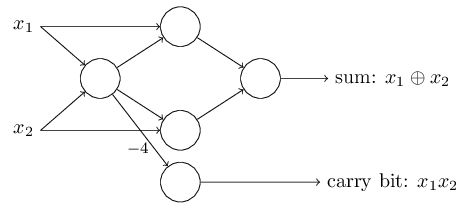

直到目前为止，我一直都把输入表示为在左侧的变量。事实上，传统的方法是新增一个输入层来表示输入：


这样的输入感知机，它有输出，但没有输入：


是一种比较简洁的表示。它并不意味着一个感知机没有输入。关于这一点，我们可以考虑一个没有输入的感知机，其权重和$\sum_j w_j x_j$永远等于0，如果$b \gt 0$输出为1，$b \lt 0$则输出为0。所以说，这个感知机只会输出一个固定的值，而不是我们期待的类似于$x_1$这样的值。所以我们应该把“输入感知机”简单的当作一个输出我们需要的值的特殊单元，而不是一个真正意义上的感知机。

上面的例子描述了一个感知机如何去模拟一个拥有许多与非门的电路。因为与非门在计算中非常普遍，所以感知机也可以实现相同的功能。

这种感知机所拥有的计算普遍性同时让人感到欣慰和失望。让人感到欣慰的是，感知机拥有同其他计算设备一样强大的能力，让人失望的是，感知机同普通的与非门并没有什么不同，所以这看起来并不算什么大的发现。

事实上，情况比我们预想的要好。我们可以利用学习算法，它可以自动的改变人工神经网络的权重和biases。这种改变来自于外部的刺激，而非编程者的直接干预。这些学习算法让人工神经元拥有与传统逻辑门非常不同的能力。与一个拥有与非门或者许多其他门的电路相比，我们的神经网络可以简单的学习解决问题，甚至是那些传统电路几乎无法解决的高难度问题。
## Sigmoid神经元

学习算法听起来非常棒，但我们该如何为神经网络设计一个这样的算法？试想我们拥有一个感知机网络，我们打算用它来解决一些问题。举例来说，假设网络的输入来自于手写数字图片的扫描像素，然后该网络自动的学习去调整它自己的权值和biases，最终的输出能正确的分类该手写数字。试想我们对网络中的权重（或者bias）做一些小的改动，如下图所示（当然这个网络对于识别手写数字来说太过于简单！）：

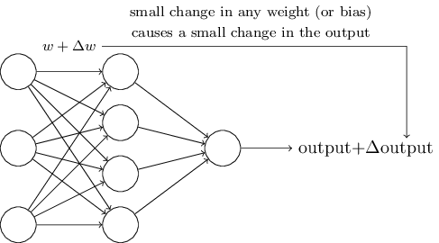

如果很小的权重变化会导致很小的输出变化是正确的，那么，我们可以利用这个事实去小心翼翼的改变网络的权重和bias，来使它的行为离我们想象的功能更近。举例来说，如果我们输入一个图片数字“8”，而网络错误的把它分类为“9”。我们可以尝试改变权重和biases，来让网络更容易把该图片数字“8”分类为“8”。不断的重复这个过程，改变网络的权重和biases，让网络的输出越来越准确。

然而问题是我们的感知机网络经常不按常理出牌。权重和bias的微小改变，有时候会造成非常大的影响，例如从输出0变为输出1。这样的改变同时会影响到网络的其余部分，造成更大的影响。这些改变和影响往往是难于控制和预测的。所以如何精确的改变权重或者biases是一个非常困难的问题，也许还有更聪明的办法。

我们可以通过引入一种新的人工神经元来克服这个困难，它叫sigmoid神经元。sigmoid神经元与感知机非常像，但微小的改变对于sigmoid神经元来说，只会造成微小的输出变化。这正是sigmoid神经元的厉害之处。

让我们用同样的方式来介绍sigmoid神经元：

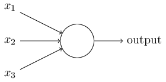

就像感知机一样，sigmoid神经元也拥有输入，$x_1, x_2, ...$

但不仅仅是0和1，它的输入可以是0和1之间的任何值。所以像0.638这样的数对于sigmoid神经元是合法的。同样的，与感知机相比，对于每个输入，sigmoid都有对应的权重，$w_1, w_2, ...$，以及一个总体的bias，$b$。它的输出也不是0或者1，而是$\sigma (w \cdot x + b)$，$\sigma$叫做*sigmoid函数\**，它是这样定义的：
$$
\sigma (z) \equiv \frac {1}{1+e^{-z}}. \tag{3}
$$

> *偶然地，$\sigma$ 有时候被称为逻辑（logistic）函数，相应地这个新的神经元种类被称为逻辑神经元。我们应该记住这个术语，因为有很多人使用它，但在本书中我会一直使用sigmoid。

为了把它表示的更为明确，我们如下定义，对于一个输入为$x_1, x_2, ...$，权重为$w_1, w_2, ...$，以及bias为$b$的sigmoid神经元来说，其输出为：
$$
\frac {1}{1+exp(-\sum_j w_j x_j - b)} \tag{4}
$$
直观的看，sigmoid神经元似乎与感知机有很大的区别。Sigmoid神经元的代数形式看起来非常的模糊，如果你对它的原理并不熟悉的话。事实上，sigmoid神经元与感知机有非常多的相似之处，那些代数形式更多的是细节上的，而不是本质上的区别。

为了理解其与感知机之间的相似性，我们设想 $z \equiv w \cdot x + b$ 是一个很大的正数，容易得出，$e^{-z} \approx 0$，$\sigma (z) \approx 1$。换句话说，当  $z = w \cdot x + b$ 是一个很大的正数时，与感知机类似，sigmoid神经元的输出约等于1。相反的，设想 $z = w \cdot x + b$ 是一个非常大的负数，即 $e^{-z} \rarr \infin, \sigma (z) \approx 0$ 。所以当 $z = w \cdot x + b$ 是一个非常大的负数时，sigmoid神经元的表现依旧相似与感知机。只有当 $w \cdot x + b$ 是一个适中的值的时候，它的表现会与感知机有比较大的偏差。

$\sigma$ 的代数形式是什么样的？我们怎么样去理解它呢？事实上，$\sigma$ 的具体形式是什么样的并不重要，重要的是它的形状：


它的形状就像一个经过光滑处理的阶跃函数：

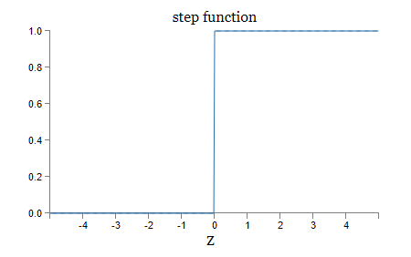

如果 $\sigma$ 事实上是一个阶跃函数，那么sigmoid神经元就是一个感知机，因为它的输出到底是0还是1取决于式子 $w \cdot x + b$ 的值是正数还是负数\*。所以，真正重要的是 $\sigma$ 函数的光滑性，而不是它的具体形式。光滑性表现在，权值和bias的微小改变 $\Delta w_j$ 和 $\Delta b$ 会导致输出微小改变 $\Delta \text{output}$ ，事实上，微积分告诉我们，$\Delta \text{output}$ 可以这样去近似：
$$
\text{output} \approx \sum_j \frac {\partial \text{output}}{\partial w_j} \Delta w_j + \frac {\partial \text{output}}{\partial b} \Delta b, \tag{5}
$$
> *事实上，当 $w \cdot x + b = 0$ 的时候，感知机会输出0，而这个阶跃函数会输出1。所以，严格地说，这个阶跃函数的定义并不完全准确，但，你懂的。

其中求和函数会遍历所有的权值 $w_j$，$\partial \text{output} / \partial w_j$ 和 $\partial \text{output} / \partial b$ 是 $\text{output}$分别对 $w_j$ 和 $b$ 求偏导。看到偏导先不要抓狂，尽管这个式子看起来很复杂，但其实说的是非常简单的事情（好消息）：$\Delta \text{output}$ 是权重和bias改变值 $\Delta w_j$ 和 $\Delta b$ 的线性函数，这种特性允许我们去选择如何改变权值和biases，来获得一个想要的输出值。所以尽管sigmoid神经元与感知机有着相似的性质，但前者可以让我们更为容易地去控制输出。

如果真正重要的是 $\sigma$ 的形状，而不是它的形式，那么我们为什么一定要用公式(3)去定义 $\sigma$ 呢？事实上，本书还会偶尔使用其他的激活函数 $f(\cdot)$ 。使用其他的激活函数带来的主要变化是公式(5)中bias的具体值的改变。事实证明，计算这些bias，使用 $\sigma$ 会简化代数，这种简化的性质来自于**指数**良好的性质。在大多数情况下，$\sigma$ 在神经网络中普遍使用，也是本书中使用最多的激活函数。

那么，我们该如何解释sigmoid神经元的输出呢？显然，sigmoid神经元和感知机之间的一个主要差别是，前者不仅仅输出0或1，而是输出0到1之间的实数，例如0.173或者0.689等等都是合法的输出。这有时候会非常的有用，例如，当我们希望输出值用来表示输入到神经网络中的一张图片像素的平均强度。但这有时候也是一件麻烦事。设想我们希望用网络的输出去指示“图片中的数字是9”，或者“图片中的数字不是9”。显然，感知机输出0或1是最简便的表示方法。但是在实际中，我们通常这样去解决这个问题：设定任何输出值大于0.5，就表示图片中的数字是9，任何输出值小于0.5，就表示图片中的数字不是9。我会在必要的时候清楚地解释这一做法，所以应该不会造成任何歧义。
<h4>习题</h4>

- **Sigmoid神经元模拟感知机，第一部分**
  设想我们给感知机中所有的权值和biases都乘以一个正的常数，$c \gt 0$。证明这个网络的性质并没有改变。
- **Sigmoid神经元模拟感知机，第二部分**
  设想同样的问题，对于网络中的感知机，任何输入 $x$，其输出 $w \cdot x + b \ne 0$ 。现在把所有的感知机都换成sigmoid神经元，然后给所有的权值和biases都乘以一个正常数，$c \gt 0$。证明当 $c \rarr \infin$ 时，sigmoid神经元网络的性质和感知机网络的性质一致。以及，为什么当 $w \cdot x + b = 0$ 时，其性质不一致。

## 神经网络的结构

在下一节中，我会介绍一个可以很好识别手写数字的神经网络。我们预先解释一些在神经网络经常会用到的术语。设想我们有如下一个网络：

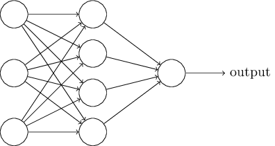

如前所述，网络中最左边的一层叫做输入层，输入层中的神经元叫做*输入神经元*。最右边的一层叫做输出层，其中的神经元叫做*输出神经元*，在这个例子中，它是一个单一的输出神经元。位于输入层和输出层中间的，叫做*隐藏层*，是因为这些层既不是输入，也不是输出。“隐藏”听起来似乎有一点神秘——我第一次听到这个词的时候，以为它们一定有着非常复杂的结构或者数学形式——其实并不是这样，这个词仅仅代表着“这些层既不是输入，也不是输出”。上图的网络只包含了一层隐藏层，有些网络包含有多层隐藏层。例如，下图的四层神经网络包含两层隐藏层：

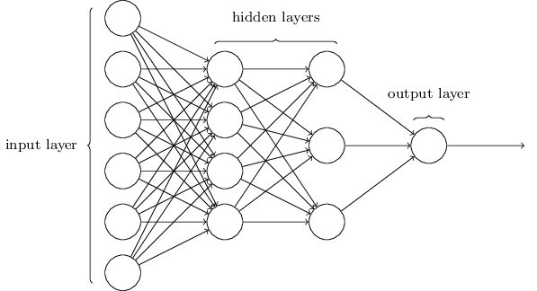

因为一些历史原因，多层网络有时候也被称为*多层感知机（multilayer perceptrons)*，或者简称为*MLPs*，尽管网络中的神经元是sigmoid神经元，而不是感知机。我不会在本书中使用MLP这个术语，因为我认为这个术语带有一定的迷惑性，但我得提醒你它的存在。

输入层和输出层的设计一般来说都是通俗易懂的。设想我们如何去确定一张手写图片的数字是不是“9”。一种自然的想法是去设计一个网络，其输入是像素的强度。例如一张64x64的灰度图，它会有 $4,096=64 \times 64$ 个输入神经元，每个输入的范围大致从0到1。输出层只有一个神经元，如果其输出值小于0.5，则代表”图片中的数字不是9“，如果其输出值大于0.5，则代表”图片中的数字是9“。

如果说神经网络输入层和输出层的设计一般都比较直接的话，那么隐藏层的设计就需要一些巧妙的想法了。一般来说，如何设计隐藏层并不能用几条简单的规则来概括。相反，神经网络的研究者们通常使用启发式*的思维来设计隐藏层，经过不断的尝试，人们最终会找到他们想要的结构。例如，可以用启发式的思维去权衡隐藏层层数和训练时间的关系。本书中会不断用到这种启发性的思维。
> *译者注：启发性的思维（heuristics）或称探索性的思维，中文读者可能一开始难以理解。我的想法是，当前最优的或者较好的解难以通过已知条件获得，或者在不同的模型、环境下有着不同的最优解，所以需要我们不断的尝试（heuristic），去寻找最佳解决方案。

到现在为止，我们讨论的神经网络都是每一层的输出当作下一层的输入，这种网络又被称为*前馈*神经网络（feedforward neural networks)。其含义是网络中并没有循环结构，信息永远都是前向传播的。如果我们允许循环存在，那意味着 $\sigma$ 函数的输入的值取决于它的输出，这听起来难以理解也没有意义，所以我们并不允许这样的循环存在。

当然，也有其他的人工神经网络允许循环存在，这样的模型叫做循环神经网络（recurrent neural networks）。循环神经网络的神经元在沉寂之前，会保持启动（fire，~~怎么翻译呢？~~）状态在一段受限的时间内。启动的神经元可以刺激其他的神经元启动。经过这样的启动、沉寂，随着时间的增长，我们会得到启动神经元的一个级联。循环在这样的模型里并不会造成歧义，因为一个神经元的输出也许会影响它的输入，但并不是立即影响，而是一段时间之后。

循环神经网络的流行程度远远不如前馈神经网络（*译者注：情况改善了不少），因为其循环网络的学习算法还不够强大（至少现在来说）。但循环神经网络还是非常非常的有趣，因为相比前馈神经网络来说，它处理信息的方式更像我们人类的大脑。而且，循环神经网络可以解决某些前馈神经网络难以处理的难题。为了限制讨论范围，本书将主要关注使用更为频繁的前馈神经网络。

## 用一个简单的网络来分类手写数字

在定义了神经网络之后，让我们回到手写数字识别的问题上。我们可以把这个问题分为两个子问题。第一，我们把一个包含很多数字的图片，分割为每张图片包含一个数字的一系列分散的独立图片。例如，我们希望把下面的图片


分割为六个独立的图片：


人类的眼睛可以很轻松的解决这样的*分割问题*（segmentation problem），但对计算机程序来说还是有一些挑战。一旦数字们被分割开以后，问题就变成了对每个数字进行分类。例如，我们希望我们的程序可以把下面的图片


识别为5。

下面我们主要关注第二个问题，分类每个独立的数字。因为当我们拥有一个分类数字的好方法之后，分割数字看起来并不是很难。事实上，已经有很多的方法去解决这样的分割问题。一种想法是，我们先尝试把图片分割为不同的片段，然后用数字分类器去分类这些片段，如果所有的片段都在分类器上得到了可信的结果，那么这次分割会得到很高的分数，如果分类器在某一个或者某些片段上无法得到可信的结果，那么这次分割会得到一个偏低的分数。例如，如果某个片段包含两个数字，那么分类器可能就无法对其做出准确的分类，从而产生一个低的分数。这种方法及其变种在解决分割问题上效果非常好。所以与其担心分割问题，我们还是专注于如何去正确的识别手写数字吧！

为了识别独立的数字，我们将会使用一个三层的神经网络：

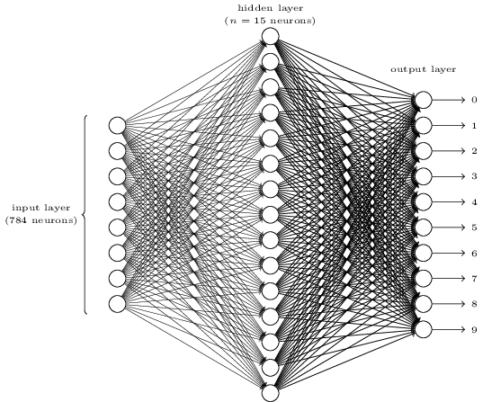

网络的输出层包含784个神经元，它们会编码输入的像素值。在下节我们将提到，我们的训练数据包含许多分辨率为28x28的手写数字图片，所以输入层包含有 $784 = 28 \times 28$ 个神经元。为了简便考虑，上图中并没有784个神经元。输入的像素是灰度值，0.0代表白色，1.0代表黑色，中间的值代表色调逐渐变暗的灰色。

网络中的第二层是隐藏层。其层数我们表示为 $n$， 在之后我们会尝试不同的 $n$。上图中网络的隐藏层层数很小，仅仅为 $n = 15$。

网络的输出层包含10个神经元。如果第一个神经元启动了，也就是说，$\text{output} \approx 1$，这说明我们的网络认为这张图片中的数字是0。如果第二个神经元启动了，则代表图片中的数字被分类为1，以此类推。更准确的说，我们把这十个神经元标记为从0到9，然后找出其中拥有最大激活值的神经元。如果这个神经元，假设它是神经元6，那意味着我们的网络认为输入的数字是6。

你也许会好奇为什么我们需要10个输出神经元。不管怎么说，我们的目的是让网络告诉我们，图片中包含的是哪个数字（$0,1,2,\dots,9$）。一种看起来更自然的方法是设置4个输出神经元，让每个神经元输出一个二元值，取决于输出更接近于0或者是1。4个神经元已经足够去回答这个问题，因为 $2^4=16$ 已经比10要大了。那么，为什么我们的网络需要10个输出神经元呢？这是不是不够效率？其实这样做的理由只有一个，当我们尝试用4个或者10个输出神经元之后会发现，使用10个输出神经元会得到更好的结果。但到底为什么10个的表现要优于4个？这里有没有什么方法可以提前告诉我们应该使用10个输出神经元而不是4个呢？

设想第一种情况，我们使用10个输出神经元。以第一个神经元为例，它的输出决定着这个图片是不是0。其输入的值取决于隐藏层的输出。那么隐藏层起了什么作用呢？我们可以这样理解，假设隐藏层的第一个神经元的作用是去检测有没有如下的图片输入：

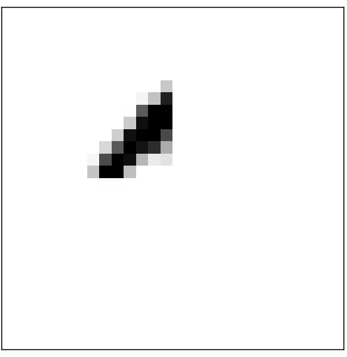

我们可以这样做，我们把输入层到隐藏层第一个神经元之间的784个权值进行有选择的赋值，与图中像素重叠的，我们设置高的权值，其他无关的，我们设置低的权值。类似的，我们假设隐藏层中其他的神经元，例如第二个、第三个、第四个神经元分别检测有无如下几个图片这样的输入：


把这四个图片组合起来会得到什么呢？


所以说，如果这四个隐藏层的神经元同时启动，我们可以总结：这个输入的图片中的数字，就是0。我们得到0可以有很多种方法，并不局限于这一种。但是我们可以说，至少在这个例子里，我们认为输入的图片里的数字是0。

如果我们这样去解释神经网络运行的机制，似乎有一定的道理，所以应该使用10个输出层神经元，而不是4个。如果我们使用4个输出神经元，那第一个输出神经元似乎是去决定这个数字最重要的位是哪个。显然，数字最重要的位很难与数字的形状建立起有意义的关系。

到现在为止，我们利用了启发式的思维去设计神经网络。没有任何证据表明隐藏层的一部分代表输入图片的一个区域，也许以后会有更聪明的算法让我们去设计只有四个神经元的输出层。这种启发式的思维效果通常很好，可以帮你节省很多用来设计神经网络结构的时间。
<h4>习题</h4>

- 我们可以给这个三层网络额外添加一层，来实现对数字的按位表示。这个额外层把上一层的输出转换为二元表示，如下图所示。为这个新的输出层找到一组权值和biases。假设前三层的神经元可以正确的分类数字，即假如输入的图片中的数字是2，则网络中第三层的第二个神经元有99%的概率激活，而不正确输出的概率小于1%。

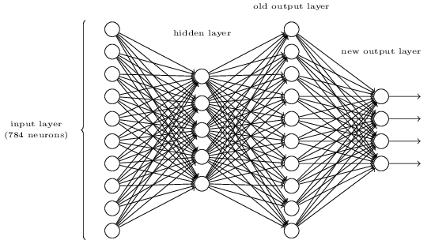

## 用梯度下降来学习

设计好神经网络之后，我们该如何利用它去识别数字呢？我们首先需要一个数据集，也就是训练集（training data set)。在本例中我们使用的是[MNIST数据集](http://yann.lecun.com/exdb/mnist/)，里面包含有上万个经过扫描得到的手写数字图片，每张图片都有一个配套的标签（label）来指明图片中的数字。MNIST数据集是在[NIST](http://en.wikipedia.org/wiki/National_Institute_of_Standards_and_Technology)（United States' National Institute of Standards and Technology，美国国家标准与技术研究院）采集的两个数据集上经过修改得来的。下面展示的是MNIST数据集中的一些图片：


这个图片和本章开头展示的图片是一样的。当然，在我们测试这个网络的性能的时候，使用的图片是不包含在训练集里的。

MNIST数据集包含两个部分。第一个部分有60,000张图片，当作训练集。共有250人参与了这些数字的书写，一半来自于美国人口普查局（US Census Bureau），另一半来自于高中学生。这些图片都是灰度图，分辨率为28x28。同样的，第二部分包含10,000张图片，当作测试集。我们会使用测试集来评估我们模型分类数字的性能。为了使我们的测试结果更加可信，测试集中的数字并不是由训练集中的250个人所写（尽管他们还是来自于美国人口普查局和高中学生）。这样做可以测试我们的模型能不能正确识别它没有见过的数据。

我们会使用符号 $x$ 去代表训练输入，每个输入 $x$ 是一个维度为 $28 \times 28 = 784$ 的向量。向量中的每一个数字代表图片中一个像素的灰度值。我们会把对应的期望输出表示为 $y = y(x)$ ，其中 $y$ 是一个10维的向量。例如，如果一个输入 $x$，它表示数字6，那么 $y = (0,0,0,0,0,0,1,0,0,0)^T$ 就是我们期望的网络输出。$T$ 在这里表示转置（Transpose）操作，把一个行向量转置为一个普通（列）向量。

我们现在需要的是一个算法，来帮助我们设置网络的权值和biases，从而输入训练数据 $x$，网络的输出可以近似为 $y(x)$。为了评估模型的效果，我们定义一个*代价函数*\*：
$$
C(w, b) = \frac {1}{2n} \sum_x ||y(x) - a||^2. \tag{6}
$$
> *有时候代价函数又称为损失函数（loss function）或者目标函数（objective function）。在本书中我将使用代价函数，但你应当熟悉其他术语，因为它们经常在研究论文或者讨论神经网络的文章里出现。

在公式中，$w$ 表示网络中的所有权值，$b$ 表示网络中所有的biases，$n$ 表示训练数据的总数，$a$ 表示当 $x$ 输入到网络后其产生的输出向量，求和符号 $\sum$ 表示网络将遍历所有的训练数据 $x$。显然，网络的输出 $a$ 取决于网络的输入 $x$，为了表达的简洁性，我并没有显式地指出这一依赖关系。符号 $||v||$ 表示向量 $v$ 的长度。我们把 $C$ 称为*二次*代价函数（quadratic cost function），有时候也被称为*均方误差*（*mean squared error, MSE*）。根据二次代价函数的形式，我们可以知道 $C(w, b)$ 是非负的，因为求和的每一项都是非负的。以及，如果当网络的输出 $y(x)$ 和 $a$ 非常接近的时候，代价 $C(w, b)$ 将会非常小，也就是说，$C(w, b) \approx 0$。也就是说，如果我们能找到一组权值和biases，使得 $C(w, b) \approx 0$，就代表着我们的算法非常有效。相反，如果 $C(w, b)$ 的值很大，说明网络的输出 $y(x)$ 距离真实的标签 $a$ 非常远。所以训练算法的终极目标就是，找到这样一组权值和biases，使得代价 $C(w, b)$ 最小化。下面我们会介绍一个著名的算法：梯度下降。

为什么要使用二次代价函数呢？毕竟我们关心的话题是模型总共正确分类了多少个数字。为什么不直接最大化这个数字，反而去最小化这个二次代价值呢？这是因为，正确分类的图片数，对于权值和biases来说，并不是一个光滑的函数。在大多数情况下，对权值和biases的微小调整，并不会对正确分类的图片数造成影响。所以如何正确地调整权值和biases使表现提升是非常困难的。但是如果我们使用光滑的函数，例如二次代价函数，这个过程就会变得简单的多。这就是为什么我们关注于最小化代价函数，而不是最大化分类准确度。

那么，如果要使用一个光滑的函数的话，我们为什么一定要使用像公式(6)这样的二次代价函数呢？这是不是一种特别的选择？如果我们选择其他的代价函数，得到的权值和biases会不会完全不同？这个问题非常有意义，待会我们会重新考虑这个代价函数，并且做一些修改。但是像公式(6)这样的代价函数对于我们理解神经网络工作的方式非常有用。

回到我们的问题上，我们的目标是找到一组合适的权值和biases，使得二次代价函数 $C(w, b)$ 最小化。这是一个适定（well-posed）的问题，但还有很多问题需要考虑，例如权值 $w$ 和biases $b$ 的解释，隐藏在背后的 $\sigma$ 函数，网络结构的选择，MNIST数据集等等。似乎我们可以暂时忽略这些问题，而把注意力集中在最小化这个问题上。所以，把问题简单化，只考虑一个有很多参数的函数，而我们想最小化这个函数。我们现在将使用*梯度下降*来解决这个最小化问题，然后再回到函数的具体形式的问题上。

让我们设想去最小化一个函数，$C(v)$。它可能是一个拥有很多实值变量的函数，$v = v_1, v_2, \dots$， 需要注意的是，我已经把符号 $w$ 或 $b$ 等等都替换为 $v$，讨论的范围已经不局限于神经网络了。假设这个函数 $C(v)$ 只有两个变量，我们称其为 $v_1, v_2$：


现在我们想找到的是 $C$ 的全局最小。当然，对于上图中的函数的最小值，我们用眼睛就可以很轻松的找到。在这个例子里，我展示的函数也许太简单了。对于一个一般地函数，$C$，拥有很多变量，用眼睛几乎是不可能找到最小值的。

解决这个问题的一个办法是，利用微积分去分析。我们可以去计算它的导数，从而找到函数 $C$ 的极值。当 $C$ 只有一个或几个变量的时候，我们也许可以幸运地找到，但如果它有非常多的变量的时候，这简直是天方夜谭。在神经网络中，变量数远远超出平常，在最大的神经网络中，其代价函数甚至拥有超过百万的权值和biases。用微积分是不能解决这个问题的。

（在假设我们的函数只有两个变量后，我已经在两个段落里重复地说“嘿，如果我们的函数有很多变量该怎么办？”）对于此我深感抱歉，，但相信我，假象它只有两个变量对于我们的理解是非常有帮助的。

OK，如果微积分不起作用的话，我们该怎么办？幸运的是，我们有一个非常美丽的算法可以很好的解决这个问题。我们先设想我们的函数是一个山谷，然后我们把一个皮球扔下去，它会顺着山谷的斜坡滚下去。我们的经验告诉我们，这个皮球最终会滚到谷底。也许我们可以利用这个想法，去找到函数的最小值？我们先把球放在一个起始点，然后模拟它滚到谷底的过程。模拟的方法是计算函数的导数（也许有时候还要计算二阶导数），这些导数可以告诉我们山谷的局部形状，告诉我们皮球会如何滚下去。

基于我刚刚描述的，你也许以为我会利用到牛顿的那些运动方程，例如摩擦力啊重力啊balabala，其实不然，我们并不是要去模拟球的运动，而是设计一个算法去最小化函数 $C$。利用球的视角并不是去限制我们的思维，而是刺激我们的想象力。（译者注：后面的废话懒得翻译了，这作者不是真的以为他很有文采吧？？？）

为了把问题定义的更为精确，让我们设想如果把球向 $v_1$ 的方向移动一小段距离 $\Delta v_1$，再向 $v_2$ 的方向移动一小段距离 $\Delta v_2$。微积分告诉我们，$C$ 会这样变化：
$$
\Delta C \approx \frac {\partial C}{\partial v_1} \Delta v_1 + \frac {\partial C}{\partial v_2} \Delta v_2. \tag{7}
$$
让我们试着找到这样一个 $v_1$ 和 $v_2$，从而使得 $\Delta C$ 为负，也就是说，我们试着让球向着谷底的方向滚。让我们定义 $\Delta v$ 是 $v$ 的变化的向量，即 $\Delta v \equiv (\Delta v_1, \Delta v_2)^T$，$T$ 是转置操作，前面已经叙述过了，把行向量变为列向量。我们还会定义 $C$ 的*梯度*，是其偏导的向量，$(\frac {\partial C}{\partial v_1}, \frac {\partial C}{\partial v_2})^T$。我们把梯度向量表示为 $\nabla C$，也就是：
$$
\nabla C \equiv (\frac {\partial C}{\partial v_1}, \frac {\partial C}{\partial v_2})^T. \tag{8}
$$
我想澄清一些人们对于梯度的迷惑。当我们第一次见到 $\nabla C$ 这样的符号时，我们也许会对这个倒三角符号 $\nabla$ 产生好奇。那么，这个符号到底是什么意思呢？事实上，把它单纯的想作一个数学符号也没什么问题，$\nabla$ 就像一个晃动的符号旗子，“嘿，$\nabla C$ 是一个梯度向量”。（译者注：你们笑了吗？美式幽默。）

在这样的定义下，$\Delta C$ 可以写作如下的形式：
$$
\Delta C \approx \nabla C \cdot \Delta v. \tag{9}
$$
这个式子可以帮助我们理解为什么 $\nabla C$ 被叫做梯度向量：$\nabla C$ 表示着 $v$ 的变化对 $C$ 的影响。但这个公式真正迷人的地方在于我们如何去选取 $\Delta v$ 从而让 $\Delta C$ 为负。特别的，当我们选取
$$
\Delta v = -\eta \nabla C, \tag{10}
$$
$\eta$ 是非常小的正的参数（也叫作*学习率*，*learning rate*）。公式(9)告诉我们 $\Delta C \approx -\eta \nabla C \cdot \nabla C = -\eta ||\nabla C||^2$。因为 $||\nabla C||^2 \ge 0$，所以可以保证 $\Delta C \le 0$，也就是说 $C$ 永远会减少，永远不会增加，如果我们像公式(10)中描述的那样去改变 $v$（当然，在公式(9)的限制之下）。这正是我们想要的特性！所以我们利用公式(10)去定义我们“球”滚动的规律，也就是梯度下降算法。也就是说，我们会用公式(10)去计算 $\Delta v$ 的值，然后把球移动那么远的距离：
$$
v \rarr v' = v - \eta \nabla C. \tag{11}
$$
然后我们根据这个规则，再进行下一次移动。如果我们不断地执行这个操作，一遍又一遍，我们将会让 $C$ 不断地下降，直到全局最小。

总结：梯度下降算法的核心思想是，重复地计算梯度 $\nabla C$，向着*相反*的方向，顺着山谷的斜坡“滚下去”。就像这样：


需要注意的是，梯度下降并不是物理运动的再现，在现实生活中，一个斜坡上的球拥有动量（momentum），可以允许它滚向谷底。相反，我们选择 $\Delta v$ 的规则就像告诉它“向下！马上！”。但这依旧是一个挺好的想法去寻找最小值。

为了让梯度下降算法正确地运作，我们需要确保学习率 $\eta$ 是一个足够小的值，从而使公式(9)是一个好的近似。如果不是的话，我们也许会得到 $\Delta C > 0$，这显然不好。同时，我们也不希望 $\eta$ 太小，这样的话，$\Delta v$ 的值将会非常小，我们的学习速度将会非常慢（也就是球滚动的速度非常慢）。在实际应用中，$\eta$ 的值会发生改变，从而使公式(9)维持一个好的近似，同时算法的效率也得到了保证。我们随后会讨论这个问题。

在描述梯度下降算法的时候，我会把 $C$ 看做一个只有两个变量的函数。如果函数 $C$ 拥有很多个变量，其性质并没有本质变化。设想函数 $C$ 拥有 $m$ 个变量，$v_1, \dots, v_m$。如果对 $C$ 的改变量为 $\Delta v = (\Delta v_1, \dots, \Delta v_m)^T$，那么：
$$
\Delta C \approx \nabla C \cdot \Delta v, \tag{12}
$$
其中梯度 $\nabla C$ 是向量：
$$
\nabla C \equiv (\frac {\partial C}{\partial v_1}, \cdots, \frac {\partial C}{\partial v_m})^T. \tag{13}
$$
就像两个变量那种情况，我们一样选取
$$
\Delta v = -\eta \nabla C, \tag{14}
$$
我们可以保证我们对于 $\Delta C$ 的（近似）表示(12)将会为负。这带给我们一种顺着梯度到达最小的方法，对于拥有多个变量的函数 $C$ 也适用，在重复地应用这个更新规则
$$
v \rarr v' = v - \eta \nabla C, \tag{15}
$$
之后，梯度下降算法得以实现。它带给我们一种改变 $v$ 位置的方法，从而去寻找函数 $C$ 的最小值。但这个规则并不总是有效，我们会在本章的后面讨论这个问题。到目前为止，梯度下降算法工作的非常好，在神经网络之中，它是最小化代价函数的一种强大的算法。

实际上，这里还有另外一种解释梯度下降算法为什么是寻找最小值的最佳策略。我们试着去移动一小步 $\Delta v$， 来让 $C$ 尽可能地减少。这等价于 $\Delta C \approx \nabla C \cdot \Delta v$。我们会控制每一次的减少值，去保证 $||\Delta v|| = \epsilon$，其中 $\epsilon > 0$ 是一个很小的固定值。换句话说，我们希望每一次的移动是一个很小的固定值，而我们想要去找到这样一个移动方向，使得 $C$ 的减小值尽可能的大。可以证明，让 $\nabla C \cdot \Delta v$ 减少最大的 $\Delta v$ 等于 $-\eta \nabla C$，其中 $\eta = \epsilon / ||\nabla C||$ 的作用是确保其大小限制为 $||\Delta v|| = \epsilon$。所以梯度下降算法可以看做找到能使 $C$ 下降最快的**方向**去移动一小步。
<h4>习题</h4>

- 证明最后一段的断言。*提示*：如果你还并不熟悉[柯西施瓦兹不等式](http://en.wikipedia.org/wiki/Cauchy%E2%80%93Schwarz_inequality)（Cauchy-Schwarz inequality），提前去了解一下会更有帮助。
- 我解释了拥有两个变量的函数 $C$ 的梯度下降算法，以及拥有多个变量时的情况。那么，如果 $C$ 是一个单变量的函数呢？请用几何的方式来说明梯度下降算法在一维的情况下是如何工作的。

人们已经研究了很多梯度下降算法的变种，包括那些真实模拟球的物理运动的变种。这些变种有一些优点，但有一个很大的缺点，即计算二阶偏导数的必要性，计算它需要的花费非常大。这可以体现在，当我们计算所有的二阶偏导数，${\partial}^2C/\partial v_j\partial v_k$，如果这里有一百万个像 $v_j$ 这样的变量，那我们就需要计算一万亿次（也就是一百万的平方）二阶偏导数*！这样的计算成本是难以承受的。但是，也有一些技巧可以避免类似的问题，对这些技巧的研究领域也非常活跃。但在本书中，我们将使用梯度下降（以及变种）作为我们学习神经网络的主要方法。
> *事实上是一万亿的一半，因为 $\partial^2C/\partial v_j\partial v_k = \partial ^2 / \partial v_k \partial v_j$，反正，你懂的。

我们该如何把梯度下降算法应用到神经网络的学习之中呢？首先的想法是利用梯度下降算法来找到权值 $w_k$ 和biases $b_l$ 从而最小化公式(6)中的代价。为了说明其本质，让我们重新阐述梯度下降更新的规则，用权值和biases来代替变量 $v_j$。换句话说，我们的“位置”（position）现在包括两个部分，$w_k, b_l$，而梯度向量 $\nabla C$ 同样也包含两个部分，$\partial C / \partial w_k, \partial C / \partial b_l$。在这两个部分的基础上，我们重新写出梯度下降算法的更新规则：
$$
\begin{aligned}
w_k &\rarr w_k' = w_k - \eta \frac {\partial C}{\partial w_k} \\ \tag{16, 17}
b_l &\rarr b_l' = b_l - \eta \frac {\partial C}{\partial b_l} 
\end{aligned}
$$
通过不断地执行这个更新规则，我们就可以“滚向谷底”，最终找到代价函数的最小值。我们可以把这个更新规则应用到神经网络的学习之中。

应用这个规则也有很多挑战。我们在之后的章节将会进行讨论。现在我只想提及一个问题。为了更好的理解这个问题，让我们回想公式(6)中的二次代价。这个代价函数的形式是 $C = \frac {1}{n} \sum _x C_x$，也就是说，它是对于每一个训练样本的代价 $C_x \equiv \frac {||y(x)-a||^2}{2}$ 的平均。在实际中，为了计算梯度 $\nabla C$，我们需要对每一个训练输入 $x$ 计算其梯度 $\nabla C_x$，然后计算其平均值，$\nabla C = \frac {1}{n} \sum_x \nabla C_x$。不幸的是，如果训练输入的数目非常大，其耗费的时间将会非常久，网络的学习就会很慢。

而*随机梯度下降算法*（*stochastic gradient descent*）可以加速这个过程。其主要思想是，在训练输入中，随机地选取一小部分样本，计算其 $\nabla C_x$，然后进一步评估梯度 $\nabla C$。通过对一小部分样本的平均，我们可以快速地得到一个还不错的对于真实梯度 $\nabla C$ 的近似值，从而对加速我们学习的过程。

更准确地说，随机梯度下降算法在训练输入中，随机地选取 $m$ 个样本，我们把这些样本标记为 $X_1, X_2, \dots, X_m$，称其为*mini-batch*。而样本大小 $m$ 的取值要尽量使 $\nabla C_{x_j}$ 约等于所有 $\nabla C_x$ 的平均值，也就是说：
$$
\frac {\sum_{j=1}^m \nabla C_{X_j}}{m} \approx \frac {\sum_x \nabla C_x}{n} = \nabla C, \tag{18}
$$
其中第二个求和是遍历整个训练集的数据。
对换边我们得到：
$$
\nabla C \approx \frac {1}{m} \sum_{j=1}^m \nabla C_{X_j}, \tag{19}
$$
这使得我们可以通过计算随机选取的mini-batch的梯度来估计全局梯度。

为了和神经网络建立起联系，我们用 $w_k$ 和 $b_l$ 来表示权值和biases。随机梯度下降算法随机地选取训练输入中的mini-batch，然后根据下面的规则来训练：
$$
\begin{aligned}
w_k \rarr w_k' = w_k &- \frac {\eta}{m} \sum_j \frac {\partial C_{X_j}}{\partial w_k} \\ \tag{20, 21}
b_l \rarr b_l' = b_l &- \frac {\eta}{m} \sum_j \frac {\partial C_{X_j}}{\partial b_l}
\end{aligned}
$$
其中的求和是遍历当前mini-batch中的所有训练数据。然后我们选取下一个mini-batch，利用其中的数据再次进行训练。持续这样的操作，直到我们遍历完所有的训练数据，也就是说，完成了一个训练*epoch*。然后我们开始训练下一个epoch。

顺便提及，一些传统对于代价函数的范围以及对于更新权值和biases的mini-batch的改变其实毫无意义。在公式(6)中，我们用 $\frac {1}{n}$ 来缩放代价函数。人们有时候忽略了 $\frac {1}{n}$，对每个训练样本进行求和，而不是平均。当我们事先不知道训练集的大小的时候，这非常有用。这可能发生在训练数据在训练的时候不断地增加、生成等。相似地，mini-batch更新规则(20)和(21)有时候也忽略了 $\frac {1}{m}$ 这一项。从概念上讲，这造成了一些不同，因为同时还缩放了学习率 $\eta$。当在细致地比较不同的模型的差别的时候，这值得我们去特别留意。

我们可以把随机梯度下降想作政治投票：采样一个小的mini-batch要比在整个batch上应用梯度下降要容易的多的多，就像发起一个投票要比完成整个选举要更容易。举例来说，对于一个训练集大小为 $n = 60,000$ 的数据集，例如MNIST，如果选取的mini-batch的大小为 $m = 10$，这意味着我们在估计梯度的时候会获得6,000倍的速度提升！当然，这些估计值并不完美——也许会有一些概率上的波动——但我们其实并不需要绝对做到完美：我们只需要找到一个大概的方向去减少 $C$，所以我们不需要一个准确地梯度计算。在实际中，随机梯度下降算法已经在神经网络中得到了广泛的应用，而它也是我们在本书中大多数学习技巧的基础。
<习题
- 一个极端地使用梯度下降的例子是把mini-batch的大小设置为1。这也就是说，给一个训练输入 $x$，我们将会这样更新权值和biases：$w_k \rarr w_k' = w_k - \eta \partial C_x / \partial w_k$ 以及 $b_l \rarr b_l' = b_l - \eta \partial C_x / \partial b_l$。然后我们选择另外一个训练输入，再次更新权值和biases。这个过程也叫作*在线学习*（*online or on-line*），或者*增量学习*（*incremental*）。对于在线学习来说，一个神经网络每次只学习一个训练样本（就像人类一样）。请说出在线学习的一个优点和一个缺点，相对于一个mini-batch大小为20的随机梯度下降模型来说。

让我们来讨论一个对学习梯度下降的新手来说经常困扰的问题作为本节的总结。在神经网络中，一个拥有很多个变量（也就是权值和biases）的代价 $C$，在某种程度上说，它定义在一个高维空间的表面。一些人经常这样去想：“啊，我要在脑海中想象这些维度！”然后他们开始担忧：“想象一个四维空间已经够困难了，更别说五维空间了！”（有时候也许是五百万维空间）是不是他们缺少了某种能力，某种只有超级数学家才拥有的能力？显然不是。就算最优秀的数学家也不能很好地想象四维空间。而他们使用的技巧是用其他的方法来表示到底发生了什么。这也正是我们之前所做的：我们用代数（而不是想象或者可视化）来表示 $\Delta C$。善于想象高位空间的人们拥有很多种技巧，我们的代数表示只是其中的一种。这些技巧也许并不如我们想象三维空间一样那么直接和容易理解，但是当你熟悉了相关的技巧之后，你就可以很好地想象高维空间了。在这方面我不会说太多，如果你有兴趣的话，这里有一些[资料](http://mathoverflow.net/questions/25983/intuitive-crutches-for-higher-dimensional-thinking)，里面有很多专业数学家用来想象高维空间的技巧。虽然有一些技巧确实非常复杂，但大多数内容都是比较容易理解的和容易掌握的。

## 实现我们用来分类数字的网络

现在，让我们利用随机梯度下降算法和MNIST数据集来写一个可以识别手写数字的程序，我们将使用Python（2.7），仅仅需要74行代码！第一件事情是去下载MNIST数据集，如果你是一名 `git` 使用者，你可以克隆本书的代码仓库去获取这个数据集，
```python
git clone https://github.com/mnielsen/neural-networks-and-deep-learning.git
```
如果你不使用 `git`，你可以点击[这里](https://github.com/mnielsen/neural-networks-and-deep-learning/archive/master.zip)去下载数据集和代码。

顺便提及，当我前面描述MNIST数据集的时候，它被分割为60,000个训练图片，以及10,000个测试图片。这是官方的MNIST说明。事实上，我们使用的MNIST数据集将有一些不同。测试集将保持不变，但是我们额外地把大小为60,000的训练集分割为包含50,000个图片的训练集去训练我们的网络，以及包含10,000个图片的*验证集*（*validation set*）。在本章中我们并不会使用验证集，但是之后我们会看到验证集对于如何选择*超参数*（*hyper-parameters*）是非常有用的——例如学习率等等，这些超参数并不会直接地被我们的算法所赋值。尽管原始的MNIST数据集没有使用验证集，但是在实际中人们使用MNIST数据集的时候会经常使用验证集，这也是神经网络中的一个通用做法。所以从现在开始，当我提及“MNIST训练集”的时候，它是一个拥有50,000张图片的数据集，而不是原始的拥有60,000张图片的数据集*。
> *前面提到，MNIST数据集是NIST（United States' National Institute of Standards and Technology，美国国家标准与技术研究院）基于两个数据集所采集而来。为了构建MNIST，Yann LeCun，Corinna Cortes以及Christopher J. C. Burges等人对NIST数据集进行了修改，并转换为一种更方便的格式。[这个链接](http://yann.lecun.com/exdb/mnist/)里有着更多的细节说明。在我的代码仓库里，MNIST数据集被进一步地进行了修改，从而可以更为方便地用Python来读取和操作。这个数据格式是我从蒙特利尔大学的LISA机器学习实验室获取的。（[链接](http://www.deeplearning.net/tutorial/gettingstarted.html)）

除了MNIST数据集，我们还需要一个Python的程序库，叫做[Numpy](http://numpy.org/)，它可以快速地对线性代数进行计算。如果你还没有安装Numpy，点击[这里](http://www.scipy.org/install.html)下载。

在给出全部代码之前，让我来解释这个神经网络代码的核心部分。其核心是一个`Network`类，我们用它来表示这个神经网络。下面的代码可以用来初始化一个`Network`对象：
```python
class Network(object):

	def __init__(self, sizes):
		self.num_layers = len(sizes)
		self.sizes = sizes
		self.biases = [np.random.randn(y, 1) for y in sizes[1:]]
		self.weights = [np.random.randn(y, x)
					    for x, y in zip(sizes[:-1], sizes[1:])]
```
在代码中，列表 `sizes` 包含不同层中的神经元数目。在这个例子中，如果我们想创建一个第一层中包含两个神经元，第二层中包含三个神经元，第三层中包含一个神经元的`Network`对象，我们可以用如下的代码来实现：
```python
net = Network([2, 3, 1])
```
网络中的权重和biases将会全部进行随机初始化，利用的是Numpy中的 `np.random.randn` 函数，从而生成期望为0，标准差为1的高斯分布。我们的随机梯度下降算法将从这个随机初始化开始。在随后的章节中，我们会学习到更好的初始化方法。需要注意的是，`Network`初始化代码中假定第一层就是神经网络的输入层，并且忽略了这些神经元的biases，因为其biases只有在下一层中计算输出的时候才会用到。

还需要注意的是，权值和biases被当做列表，存储在Numpy的矩阵中。所以，Numpy矩阵 `net.weights[1]` 中存储的是连接第二层神经元和第三层神经元的权值（并不是第一层和第二层，因为Python列表是从0开始计数的）。因为 `net.weights[1]` 表示起来过于冗长，我们用 $w$ 来表示这个矩阵。举个例子，矩阵中的 $w_{jk}$ 表示的是连接第二层中第 $k^{th}$ 个神经元，以及第三层中第 $j^{th}$ 个神经元的权重。使用 $j$ 和 $k$ 这样的顺序似乎有一些奇怪——如果把 $j$ 和 $k$ 调换次序是不是会更符合常理？其实，使用这样的顺序有一个巨大的优点，也就是第三层中的神经元的激活向量可以这样表示：
$$
a' = \sigma (wa + b). \tag{22}
$$
这个公式里包含的信息量很大，让我们一步一步地去分析。$a$ 是第二层中神经元的激活向量。为了获得 $a'$，我们用权值矩阵 $w$ 去乘以 $a$，然后再加上biases向量 $b$，然后我们对向量 $wa + b$ 的每一个输入应用函数 $\sigma$（这也称为对函数 $\sigma$ 进行*矢量化*（*vectorizing*））。在计算sigmoid神经元的输出之后，我们很容易证明公式(22)和公式(4)拥有相同地结果。
<h4>习题</h4>

- 用组件的形式（component form）重写公式(22)，在计算sigmoid神经元的输出之后，证明其结果与公式(4)的结果相同。

在把这些记住以后，计算一个`Network`实例的输出就非常容易了。我们从定义sigmoid函数开始：
```python
def sigmoid(z):
	return 1.0/(1.0+np.exp(-z))
```
需要注意的是，当输入 $z$ 是一个向量或者Numpy数组的时候，Numpy会自动地把函数sigmoid应用到每一个元素上。

我们然后给`Network`类添加一个`feedforward`方法，即给网络一个输入 $a$，返回相应的输出*。这些方法做的事情就是将公式(22)应用到神经网络的每一层：
```python
def feedforward(self, a):
	""" Return the output of the network if "a" is input. """
	for b, w in zip(self.biases, self.weights):
		a = sigmoid(np.dot(w, a)+b)
	return a
```
> *这也就是说，输入是一个 (n, 1)型的Numpy多维数组（ndarray），而不是一个(n,)型向量。在这里，n是网络中输入的个数。如果你尝试使用一个(n,)向量作为输入，你会得到奇怪的结果。尽管使用(n,)向量看起来是一种更为自然的选择，但使用(n, 1)多维数组是更为容易更为方便的做法。

当然，我们想要`Network`类能够学到什么东西。为了做到这一点，我们会给它一个`SGD`方法，也就是随机梯度下降算法。下面展示的是代码，里面有几处看起来并不好理解，但我随后会一一解释：
```python
def SGD(self, training_data, epochs, mini_batch_size, eta, 
		test_data=None):
	""" Train the neural network using mini-batch stochastic 
	gradient descent. The "training_data" is a list of tuples
	"(x, y)" representing the training inputs and the desired 
	ouputs. The other non-optional parameters are 
	self-explainatory. If "test-data" is provided then the 
	network will be evaluated against the test data after each 
	epoch, and partial progress printed out. This is useful for 
	tracking progress, but slows things down substantially. """
	if test_data:
		n_test = len(test_data)
	n = len(training_data)
	for j in xrange(epochs):
		random.shuffle(training_data)
		mini_batches = [
			training_data[k:k+mini_batch_size]
			for k in xrange(0, n, mini_batch_size)]
		for mini_batch in mini_batches:
			self.update_mini_batch(mini_batch, eta)
		if test_data:
			print "Epoch {0}: {1} / {2}".format(
				j, self.evaluate(test_data), n_test)
		else:
			print "Epoch {0} complete".format(j)
```
其中 `training_data` 是一个包含元组 (**x, y**) 的列表，表示训练输入和相应的输出。变量 `epochs` 和变量 `mini_batch_size` 如其字面意思所示。`eta` 是学习率 $\eta$。如果提供了可选参数 `test_data`，那么程序将会在每轮训练之后评估网络，并打印出部分进展。这对于跟踪程序的进展非常有用，但会降低程序运行的效率。

在每一个epoch中，它开始于随机地打乱整个训练数据，然后把数据分割为大小合适的mini-batch。这是一种简单的随机采样方法。对于每一个mini-batch，我们应用一次梯度下降。这一步由代码 `self.update_mini_batch(mini_batch, eta)`实现，它可以根据根据每一次的梯度下降，来更新网络的权值和biases，仅仅使用到mini-batch中的训练数据。下面是`update_mini_batch`方法的代码：
```python
def update_mini_batch(self, mini_batch, eta):
	""" Update the network's weights and biases by applying
	gradient descent using backpropagation to a single mini batch. 
	The "mini_batch" is a list of tuple "(x, y)", and "eta"
	is the learning rate. """
	nabla_b = [np.zeros(b.shape) for b in self.biases]
	nabla_w = [np.zeros(w.shape) for w in self.weights]
	for x, y in mini_batch:
		delta_nabla_b, delta_nabla_w = self.backprop(x, y)
		nabla_b = [nb+dnb for nb, dnb in zip(nabla_b, delta_nabla_b)]
		nabla_w = [nw+dnw for nw, dnw in zip(nabla_w, delta_nabla_w)]
	self.weights = [w-(eta/len(mini_batch))*nw
					for w, nw in zip(self.weights, nabla_w)]
	self.biases = [b-(eta/len(mini_batch))*bw
					for b, nb in zip(self.biases, nabla_b)]
```
最主要的工作由下面这行代码所完成：
```python
		delta_nabla_b, delta_nabla_w = self.backprop(x, y)
```
这涉及了一个算法，叫做*反向传播算法*（*backpropagation algorithm*），它可以快速地计算代价函数的梯度。所以`update_mini_batch`方法对`mini-batch`中的每一个样本计算梯度，然后适当地更新`self.weights`和`self.biases`。

我现在并不会马上展示`self.backprop`的代码（译者注：下面不就展示了么？[○･｀Д´･ ○]），我们将在下一章中学习反向传播是如何工作的，包括其代码。你可以把它想象为一个可以计算合适的梯度的函数就好。

让我们来看看包括文档说明的完整程序。除了`self.backprop`方法是自解释的以外——所有的重要工作都由方法`self.SGD`和方法`self.update_mini_batch`完成。`self.backprop`方法还额外地使用了一些其他函数来辅助计算梯度，例如`sigmoid_prime`，它可以计算 $\sigma$ 函数的导数，还有`self.cost_derivative`，但我暂时还不会介绍它。你可以通过看代码和文档来了解这个函数的大意（也许包括细节）。我们将会在下一章仔细讨论它。需要注意的是，当程序变得冗长的时候，其实大部分代码都是文档，文档可以帮助程序变得容易阅读和理解。实际上，程序中只包含有74行的非空行、非文档代码。所有的代码都可以在[Github](https://github.com/mnielsen/neural-networks-and-deep-learning/blob/master/src/network.py)上找到。
```python
"""
network.py
~~~~~~~~~~

A module to implement the stochastic gradient descent learning
algorithm for a feedforward neural network.  Gradients are calculated
using backpropagation.  Note that I have focused on making the code
simple, easily readable, and easily modifiable.  It is not optimized,
and omits many desirable features.
"""

#### Libraries
# Standard library
import random

# Third-party libraries
import numpy as np

class Network(object):

    def __init__(self, sizes):
        """The list ``sizes`` contains the number of neurons in the
        respective layers of the network.  For example, if the list
        was [2, 3, 1] then it would be a three-layer network, with the
        first layer containing 2 neurons, the second layer 3 neurons,
        and the third layer 1 neuron.  The biases and weights for the
        network are initialized randomly, using a Gaussian
        distribution with mean 0, and variance 1.  Note that the first
        layer is assumed to be an input layer, and by convention we
        won't set any biases for those neurons, since biases are only
        ever used in computing the outputs from later layers."""
        self.num_layers = len(sizes)
        self.sizes = sizes
        self.biases = [np.random.randn(y, 1) for y in sizes[1:]]
        self.weights = [np.random.randn(y, x)
                        for x, y in zip(sizes[:-1], sizes[1:])]

    def feedforward(self, a):
        """Return the output of the network if ``a`` is input."""
        for b, w in zip(self.biases, self.weights):
            a = sigmoid(np.dot(w, a)+b)
        return a

    def SGD(self, training_data, epochs, mini_batch_size, eta,
            test_data=None):
        """Train the neural network using mini-batch stochastic
        gradient descent.  The ``training_data`` is a list of tuples
        ``(x, y)`` representing the training inputs and the desired
        outputs.  The other non-optional parameters are
        self-explanatory.  If ``test_data`` is provided then the
        network will be evaluated against the test data after each
        epoch, and partial progress printed out.  This is useful for
        tracking progress, but slows things down substantially."""
        if test_data: n_test = len(test_data)
        n = len(training_data)
        for j in xrange(epochs):
            random.shuffle(training_data)
            mini_batches = [
                training_data[k:k+mini_batch_size]
                for k in xrange(0, n, mini_batch_size)]
            for mini_batch in mini_batches:
                self.update_mini_batch(mini_batch, eta)
            if test_data:
                print "Epoch {0}: {1} / {2}".format(
                    j, self.evaluate(test_data), n_test)
            else:
                print "Epoch {0} complete".format(j)

    def update_mini_batch(self, mini_batch, eta):
        """Update the network's weights and biases by applying
        gradient descent using backpropagation to a single mini batch.
        The ``mini_batch`` is a list of tuples ``(x, y)``, and ``eta``
        is the learning rate."""
        nabla_b = [np.zeros(b.shape) for b in self.biases]
        nabla_w = [np.zeros(w.shape) for w in self.weights]
        for x, y in mini_batch:
            delta_nabla_b, delta_nabla_w = self.backprop(x, y)
            nabla_b = [nb+dnb for nb, dnb in zip(nabla_b, delta_nabla_b)]
            nabla_w = [nw+dnw for nw, dnw in zip(nabla_w, delta_nabla_w)]
        self.weights = [w-(eta/len(mini_batch))*nw
                        for w, nw in zip(self.weights, nabla_w)]
        self.biases = [b-(eta/len(mini_batch))*nb
                       for b, nb in zip(self.biases, nabla_b)]

    def backprop(self, x, y):
        """Return a tuple ``(nabla_b, nabla_w)`` representing the
        gradient for the cost function C_x.  ``nabla_b`` and
        ``nabla_w`` are layer-by-layer lists of numpy arrays, similar
        to ``self.biases`` and ``self.weights``."""
        nabla_b = [np.zeros(b.shape) for b in self.biases]
        nabla_w = [np.zeros(w.shape) for w in self.weights]
        # feedforward
        activation = x
        activations = [x] # list to store all the activations, layer by layer
        zs = [] # list to store all the z vectors, layer by layer
        for b, w in zip(self.biases, self.weights):
            z = np.dot(w, activation)+b
            zs.append(z)
            activation = sigmoid(z)
            activations.append(activation)
        # backward pass
        delta = self.cost_derivative(activations[-1], y) * \
            sigmoid_prime(zs[-1])
        nabla_b[-1] = delta
        nabla_w[-1] = np.dot(delta, activations[-2].transpose())
        # Note that the variable l in the loop below is used a little
        # differently to the notation in Chapter 2 of the book.  Here,
        # l = 1 means the last layer of neurons, l = 2 is the
        # second-last layer, and so on.  It's a renumbering of the
        # scheme in the book, used here to take advantage of the fact
        # that Python can use negative indices in lists.
        for l in xrange(2, self.num_layers):
            z = zs[-l]
            sp = sigmoid_prime(z)
            delta = np.dot(self.weights[-l+1].transpose(), delta) * sp
            nabla_b[-l] = delta
            nabla_w[-l] = np.dot(delta, activations[-l-1].transpose())
        return (nabla_b, nabla_w)

    def evaluate(self, test_data):
        """Return the number of test inputs for which the neural
        network outputs the correct result. Note that the neural
        network's output is assumed to be the index of whichever
        neuron in the final layer has the highest activation."""
        test_results = [(np.argmax(self.feedforward(x)), y)
                        for (x, y) in test_data]
        return sum(int(x == y) for (x, y) in test_results)

    def cost_derivative(self, output_activations, y):
        """Return the vector of partial derivatives \partial C_x /
        \partial a for the output activations."""
        return (output_activations-y)

#### Miscellaneous functions
def sigmoid(z):
    """The sigmoid function."""
    return 1.0/(1.0+np.exp(-z))

def sigmoid_prime(z):
    """Derivative of the sigmoid function."""
    return sigmoid(z)*(1-sigmoid(z))
```
我们的程序到底在识别手写数字这个问题上做的如何呢？让我们从加载MNIST数据集开始。我会用到一个小小的帮助程序，`mnist_loader.py`。我们先在Python Shell中执行下面的命令，
```python
>>> import mnist_loader
>>> train_data, validation_data, test_data = \
... mnist_loader.load_data_wrapper()
```
当然，这个操作也可以在一个单独的Python文件中执行，但在Python Shell中执行会更方便一些。

在加载数据之后，我们创建一个拥有30个隐藏神经元的`Network`。首先导入`network`包，然后创建这个网络，
```python
>>> import network
>>> net = network.Network([784, 30, 10])
```
最后，我们利用随机梯度下降算法在MNIST `training_data` 中学习30个epoch，mini-batch大小为10，学习率 $\eta = 3.0$，
```python
net.SGD(training_data, 30, 10, 3.0, test_data=test_data)
```
现在程序将花费一定的时间去执行，对于一个普通的机器来说（在2015年），它需要几分钟的视角去执行。我建议你在执行程序的时候，继续阅读本书，时不时地去检查一下进度。如果你想加快程序执行的速度，你可以通过以下几种方法：减少隐藏层的神经元数目、减少epoch的轮数、或者仅仅使用部分测试数据。需要注意的是，在实际生产环境中，程序执行的速度会非常非常低快，因为这些Python代码的主要目的是让你更好地理解神经网络运作的方式，而不是高性能代码！以及，当我们的网络训练好之后，它几乎可以在任何计算平台上快速地运行。例如，当我们学习好网络的权值和biases之后，它可以非常简单地移植为JavaScript代码，从而在浏览器中运行，或者在移动设备上的原生app上运行。下面是我们的神经网络完整地训练一次之后的输出记录。这个记录显示了每执行一次epoch之后，网络在总共正确分类了多少个测试集图片。如你所见，仅仅在一次epoch之后，它的输出就到达了9,129/10,000，而且这个数字还在不断地增长，
```python
Epoch 0: 9129 / 10000
Epoch 1: 9295 / 10000
Epoch 2: 9348 / 10000
...
Epoch 27: 9528 / 10000
Epoch 28: 9542 / 10000
Epoch 29: 9534 / 10000
```
也就是说，这个训练好的网络的分类正确率大约是95%，最高达到了95.42%（epoch 28）！对于第一次尝试来说，这是一个令人兴奋的结果。需要注意的是，你运行的结果可能与上述结果并不完全相同，因为我们在初始化网络的权值和biases的时候，使用的是（不同地）随机初始化。为了得到本章中的结果，我执行了三次程序，并选择了效果最好的那次。

让我们再次运行上述的实验，并且把隐藏层中的神经元数目更改为100。如果你上一次执行的代码还没有结束的话，那我得提醒你这次执行可能会花费很久的时间（在我的机器上，每一轮epoch大约会花费几十秒的时间），所以最好边执行代码，边阅读本文。
```python
>>> net = network.Network([784, 100, 10])
>>> net.SGD(training_data, 30, 10, 3.0, test_data=test_data)
```
确实，这样做的话，最终的结果提高到了大约96.59%。至少在这个例子中，使用更多地隐藏神经元可以帮助我们得到更好的结果*。
> *读者们的反馈显示，实验的结果有着很大的不同和偏差，有的时候得到的结果非常的差距。第三章会介绍一些技巧，可以显著地减少结果的变动。

当然，为了得到这样的结果，我需要对训练的轮数、mini-batch的大小、学习率 $\eta$ 等做特定的选择。就像我前面提到的，这些参数又被称为超参数，它们和普通的参数（例如权值和biases）有着明显的差异。如果我们选择了很差的超参数，那么我们得到的结果就可能会很差。设想，如果我们选择的学习率为 $\eta = 0.001$，
```python
>>> net = network.Network([784, 100, 10])
>>> net.SGD(training_data, 30, 10, 0.001, test_data=test_data)
```
结果并不好，
```python
Epoch 0: 1139 / 10000
Epoch 1: 1136 / 10000
Epoch 2: 1135 / 10000
...
Epoch 27: 2101 / 10000
Epoch 28: 2123 / 10000
Epoch 29: 2142 / 10000
```
虽然其结果在缓慢地变好。这告诉我们应该增加学习率，例如 $\eta = 0.01$。如果我们这样做，我们将得到了更好的结果。这告诉我们应该继续增加学习率。（如果做一件事情提升了效果，那就再做一次！）如果我们不断地这样尝试，我们最终会得到一个效果比较好的学习率，例如 $\eta = 1.0$（也许更好地调节为 $3.0$）。因此，就算我们一开始初始化了效果并不好的超参数，我们也可以经过不断地尝试，获得足够的信息来帮助我们选择更好的超参数。

总的来说，调试一个超参数有时候会很有挑战。特别是当我们的初始超参数的结果还不如随机选择的时候。设想我们调试一个拥有30个隐藏神经元的神经网络，如果我们把学习率更改为 $\eta = 100.0$：
```python
>>> net = network.Network([784, 30, 10])
>>> net.SGD(training_data, 30, 10, 100.0, test_data=test_data)
```
此时，我们发现学习率设置的过高：
```python
Epoch 0: 1009 / 10000
Epoch 1: 1009 / 10000
Epoch 2: 1009 / 10000
Epoch 3: 1009 / 10000
...
Epoch 27: 982 / 10000
Epoch 28: 982 / 10000
Epoch 29: 982 / 10000
```
现在想象我们第一次遇到这样的问题。当然，根据前面的实验，我们*知道*现在应该做的事情是去减少学习率。但如果我们第一次遇到这样的问题，并没有什么东西可以指导我们做出正确的选择。不仅是学习率，我们会对网络中的所有选择感到困扰。我们也许会疑问，如果初始化了难以让网络学习的权值和biases该怎么办？如果我们没有足够的训练数据去得到一个有意义的结果该怎么办？也许我们没有训练足够多的epochs？或者对于这个网络结构来说，它根本就不可能完成识别手写数字这样的任务？也许学习率设置的太低？或者太高？当你第一次遇到这些问题的时候，你不能总是确定该怎么办。

这些教训让我们知道，调试一个神经网络并不是一个微不足道的事情，以及，对于一个平常的程序来说，里面也有很多奇妙的技巧。你需要去学习调试的艺术，从而得到较好的结果。更为一般地，我们需要利用启发式的思维去选择网络的超参数以及网络的结构。我将在本书中不断地讨论这些问题，包括我刚刚描述的选择超参数的技巧。
<h4>习题</h4>

- 尝试建立一个只有两层的网络，输入层和输出层，即没有隐藏层，只有大小为784的输入层和大小为10的输出层。用随机梯度下降来训练这个网络。你得到的训练精度是多少？

之前我忽略了MNIST数据集是如何加载的细节。其实非常简单和直接。为了完整性考虑，下面贴出代码。你可以在代码文档中了解到存储MNIST数据集的数据结构，都是很简单的东西，包括元组和Numpy `ndarray`对象的列表等（如果你还不熟悉什么是`ndarray`，把它们想象为向量就好）：
```python
"""
mnist_loader
~~~~~~~~~~~~

A library to load the MNIST image data.  For details of the data
structures that are returned, see the doc strings for ``load_data``
and ``load_data_wrapper``.  In practice, ``load_data_wrapper`` is the
function usually called by our neural network code.
"""

#### Libraries
# Standard library
import cPickle
import gzip

# Third-party libraries
import numpy as np

def load_data():
    """Return the MNIST data as a tuple containing the training data,
    the validation data, and the test data.

    The ``training_data`` is returned as a tuple with two entries.
    The first entry contains the actual training images.  This is a
    numpy ndarray with 50,000 entries.  Each entry is, in turn, a
    numpy ndarray with 784 values, representing the 28 * 28 = 784
    pixels in a single MNIST image.

    The second entry in the ``training_data`` tuple is a numpy ndarray
    containing 50,000 entries.  Those entries are just the digit
    values (0...9) for the corresponding images contained in the first
    entry of the tuple.

    The ``validation_data`` and ``test_data`` are similar, except
    each contains only 10,000 images.

    This is a nice data format, but for use in neural networks it's
    helpful to modify the format of the ``training_data`` a little.
    That's done in the wrapper function ``load_data_wrapper()``, see
    below.
    """
    f = gzip.open('../data/mnist.pkl.gz', 'rb')
    training_data, validation_data, test_data = cPickle.load(f)
    f.close()
    return (training_data, validation_data, test_data)

def load_data_wrapper():
    """Return a tuple containing ``(training_data, validation_data,
    test_data)``. Based on ``load_data``, but the format is more
    convenient for use in our implementation of neural networks.

    In particular, ``training_data`` is a list containing 50,000
    2-tuples ``(x, y)``.  ``x`` is a 784-dimensional numpy.ndarray
    containing the input image.  ``y`` is a 10-dimensional
    numpy.ndarray representing the unit vector corresponding to the
    correct digit for ``x``.

    ``validation_data`` and ``test_data`` are lists containing 10,000
    2-tuples ``(x, y)``.  In each case, ``x`` is a 784-dimensional
    numpy.ndarry containing the input image, and ``y`` is the
    corresponding classification, i.e., the digit values (integers)
    corresponding to ``x``.

    Obviously, this means we're using slightly different formats for
    the training data and the validation / test data.  These formats
    turn out to be the most convenient for use in our neural network
    code."""
    tr_d, va_d, te_d = load_data()
    training_inputs = [np.reshape(x, (784, 1)) for x in tr_d[0]]
    training_results = [vectorized_result(y) for y in tr_d[1]]
    training_data = zip(training_inputs, training_results)
    validation_inputs = [np.reshape(x, (784, 1)) for x in va_d[0]]
    validation_data = zip(validation_inputs, va_d[1])
    test_inputs = [np.reshape(x, (784, 1)) for x in te_d[0]]
    test_data = zip(test_inputs, te_d[1])
    return (training_data, validation_data, test_data)

def vectorized_result(j):
    """Return a 10-dimensional unit vector with a 1.0 in the jth
    position and zeroes elsewhere.  This is used to convert a digit
    (0...9) into a corresponding desired output from the neural
    network."""
    e = np.zeros((10, 1))
    e[j] = 1.0
    return e
```
(译者注：其实我懒的看这些代码的细节，但作者的文档（documentation strings）写的很好，这是一个很棒的习惯！）

我前面说过我们程序的分类准确度非常不错。这到底意味着什么？准确度的标准是多少？和谁比较呢？所以说，把我们的程序和一些其他的程序（又称基准，baseline）进行比较是非常有意义的。最最简单的baseline，就是随机地猜测数字。概率论告诉我们，其结果大约等于10%。当然，我们还有更多的baseline去比较。

让我们尝试一个更极端的简单例子：我们检查一个图片到底有多“暗”。例如，一个包含数字2的图片，一般来说比包含数字1的图片更暗，因为前者的图片中有更多的像素是深色的，就像下面的图片所展示的一样：


这个想法让我们去计算训练数据中每个数字的平均加和暗度。当获得一个新的图片时，我们计算这个图片有多“暗”，然后根据暗度来猜测图片中的数字是几。这是一个简单的操作，代码也很简单，所以我就不在这里贴出来了，如果你感兴趣的话，可以在这个[Github仓库](https://github.com/mnielsen/neural-networks-and-deep-learning/blob/master/src/mnist_average_darkness.py)里找到代码。不管怎么说，相比较于随机猜测数字，这个想法的准确率有着很大的提升，它可以把10,000张图片成功分类2,225张，也就是说，准确度是22.25%。

还有很多的方法，可以获得大约从20%到50%的准确度。有时候如果你幸运的话，甚至可以超过50%。但是如果想得到更高的准确度，我们有时候就需要利用到机器学习的算法了。让我们来尝试一个非常有名的算法，*支持向量机*（*support vector machine, SVM*）。如果你还不熟悉SVMs，不要担心，我们并不需要去理解SVMs是如何运作的。相反，我们会用到一个Python库，叫做[scikit-learn](http://scikit-learn.org/stable/)，它提供了一个简单的Python接口到一个基于C语言库的SVMs，也就是知名的[LIBSVM](http://www.csie.ntu.edu.tw/~cjlin/libsvm/)。

如果我们使用默认的设置来运行scikit-learn的SVM分类器，它的结果是成功分类了9,435张图片。（这里是[代码](https://github.com/mnielsen/neural-networks-and-deep-learning/blob/master/src/mnist_svm.py)）相比较于用暗度来分类，这是一个巨大的提升。事实上，这意味着SVM的性能和我们的神经网络已经相差无几了，只是稍微差了一点。在之后的章节中，我会介绍更多的技巧去提升我们的神经网络的性能。

故事还没有结束。94.35%的准确度是在scikit-learn中SVMs的默认设置下得到的。其实SVMs有很多可以调节的参数，所以说，如果我们进一步调试参数的话，有可能得到更好的结果。我并不会在这里进一步进行讨论，如果你感兴趣的话，可以看看这篇[Andreas Mueller](http://peekaboo-vision.blogspot.ca/)写的[博客](http://peekaboo-vision.blogspot.de/2010/09/mnist-for-ever.html)。Mueller表示如果很好地调节了SVM的参数的话，其准确度甚至可以达到98.5%。换句话说，精心调节的SVM在每次分类70张图片的时候，仅仅会错误一次。这个结果非常的好！我们的神经网络可不可以做的更好呢？

事实上，可以。到目前为止，一个经过很好调节的神经网络的准确度，在MNIST数据集上，超过了其他所有的模型，包括SVMs。最近（2013）保持的记录是99.79%，由[Li Wan](http://www.cs.nyu.edu/~wanli/)、[Matthew Zeiler](http://www.matthewzeiler.com/)、Sixin Zhang、[Yann LeCun](http://yann.lecun.com/)以及[Rob Fergus](http://cs.nyu.edu/~fergus/pmwiki/pmwiki.php)等人达成。后面我们会介绍他们所利用到的大部分技巧。这个结果可以说，已经达到了人类识别的水平，甚至可以说超过人类。因为在MNIST数据集中，有些图片对于人类来说，也是难以正确分类的，例如：


我相信你会同意这些图片真的很难去分类。而神经网络在10,000张图片中仅仅错误分类了21张，真是让人难以置信。通常来说，在编程的时候，当我们尝试去解决一个复杂的问题，例如识别手写数字，我们相信这需要一个特别复杂的程序才可以做到。但在神经网络中，甚至是Wan等人的论文中，也只是使用了我们刚刚见过的很简单的算法。从训练数据中，所有的复杂性都被自动地学习到了。在某种程度上，我们可以说：
$$
复杂的算法 \le 简单地学习算法 + 好的学习数据.
$$

## 靠近深度学习

当我们的神经网络产生令人印象深刻的表现时，这种表现有时候带有某种神秘色彩。因为网络的权值和biases是自动学习到的，我们甚至都不需要解释我们的网络是如何完成这样的事情的。我们能不能找到隐藏在神经网络之后的秘密呢？如果可以的话，我们是不是可以做的更好？

让我们把问题说的更完整些，设想几十年来神经网络所促进的人工智能（artificial intelligence, AI）。我们会理解这些智能的网络是如何运作的吗？这些网络对我们来说是不透明的。在早期的AI研究中，人们相信对AI的研究可以帮助我们了解智能背后的原则，甚至是人类大脑的秘密。但结果可能是我们既没有了解AI或者神经网络，也没有了解人类的大脑。

回想本章开头所描述的人工神经元，它是一种衡量事实的方法。假如我们想去确认一张图片里面是不是包含人脸：

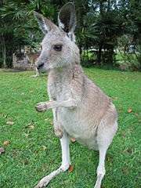


> 出处：1）[Ester Inbar](http://commons.wikimedia.org/wiki/User:ST) 2）未知 3）NASA，ESA，G. Illingworth，D. Magee以及P. Oesch（加州大学圣克鲁兹分校），R. Bouwens（莱登大学）以及HUDF09团队。点击图片链接查看更多信息：[一](http://neuralnetworksanddeeplearning.com/images/Kangaroo.JPG)、[二](http://neuralnetworksanddeeplearning.com/images/Einstein_crop.jpg)、[三](http://neuralnetworksanddeeplearning.com/images/hubble.jpg)。

我们将使用相同的方法来解决这个问题，使用图片的像素作为神经网络的输入，神经网络的输出来自于单个神经元，表示“是的，图片中包含人脸”或者“不是的，图片中没有人脸”。

让我们设想去做这件事情，但并不使用学习算法。相反，我们将尝试着去设计一个网络，手动选择合适的权值和biases。我们该怎么样做这件事情呢？此刻先忘记掉所有关于神经网络的知识，我们可以用启发式的方法，把问题分解为子问题：这张图片在左上角有没有一个眼睛？这张图片在右上角有没有一个眼睛？在中间有没有一个鼻子？在中下部有没有一个嘴巴？在上面有没有头发？等等。

如果这些问题的回答是“有”，或者仅仅是“可能有”，那我们可以总结出，这张图片很可能包含人脸。相反，如果这些问题的回答大多数都是“没有”，那这张图片很可能不包含人脸。

当然，这只是一个粗糙的探索，还面临着许多不足。也许图片中的人是秃头，他没有头发。也许我们只能看到半张脸，或者这张脸处于不同的角度，其中的某些特征并不可见。但如果我们能解决这些子问题，并且把子问题结合起来，我们也许就能建立起一个神经网络，从而解决这个人脸识别问题。这里有一个可能的结构，矩形框代表着子网络。需要注意的是，这个方法并不是真的能解决人脸识别问题，它是用来帮助我们了解网络的运作方式。下面是它的结构：


我们发现，这些子问题似乎也可以被分解。设想我们在考虑这个问题：左上角有没有一个眼睛？这个问题可以被分解为更多的问题：那里有没有眉毛？有没有睫毛？有没有虹膜？等等。当然，这些问题都应该包含位置信息，比如：在左上方有没有一个眉毛，并且在虹膜的上方？但我们暂时先把问题简单化。问题“左上方有没有一个眼睛”可以被这样分解：

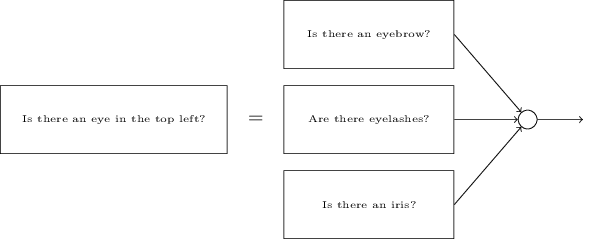 

这些子问题还可以被进一步地分解，经过更多更多的层。最终，我们会得到很多子网络，它们可以在像素的层面上回答简单的问题。这些问题也许，举个例子，是去检测图片中的某一个地方存在或者不存在特定的形状。这些问题可以被一个连接到相关像素的单个神经元所回答。

我们最终生成的网络，可以把一个复杂的问题，例如人脸识别，分解为可以在像素层面上容易回答的子问题。这个网络包含有许多层，前面的层回答简单的和特定的问题，后面的层则建立起一个更为复杂的、抽象的层级结构。这样的网络一般拥有两层或更多的隐藏层，我们称其为*深度神经网络*（*deep neural networks*）。

当然，我还没有解释如何去把网络递归地分解为子网络。人工地去给网络的权值和biases赋值显然并不现实。相反，我们希望用学习算法，从而使网络可以自动地学习到权值和biases，以及隐藏在数据背后的概念层级。80年代和90年代的研究者们试着用随机梯度下降算法和反向传播来训练深度网络。不幸的是，除了某些特殊的结构，网络的效果并不好。这些网络虽然在不断地学习，但速度非常的慢，在实际中难以发挥作用。

从2006年开始，人们开发了一系列神经网络的技巧，从而使深度神经网络开始展现威力。这些深度学习的技巧基于随机梯度下降和反向传播，而且融入了新的东西。这些技巧使得更深（以及更大）的网络的训练成为可能，现在，训练一个拥有五到十个隐藏层的神经网络已经很常见了。并且，深度网络展现出了浅层网络所没有的强大能力。原因当然是深度网络拥有更复杂的概念层级。这很像传统的编程语言，它们使用模块设计和抽象等技巧来实现复杂的计算机软件。比较深度网络和浅层网络就像比较一个拥有函数的编程语言和没有函数的编程语言。神经网络中的抽象（abstraction）和传统编程语言中的抽象有一些不同，但它们都同样重要。

（译者注：四万多字！终于译完啦~开始第二章！如果读者（如果有读者的话）发现任何错误或疑问，欢迎留言或者给我发邮件啦！）

**Next:

[第二章 反向传播算法是如何工作的](https://blog.csdn.net/xovee/article/details/85267627)**
