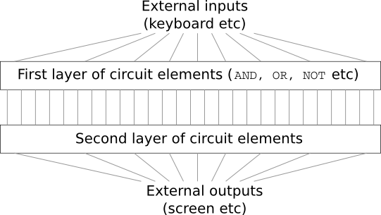
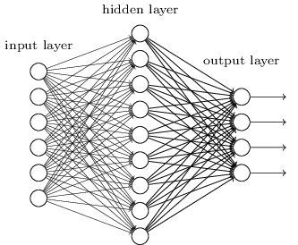
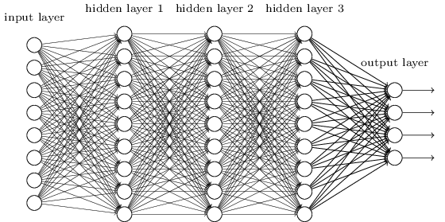
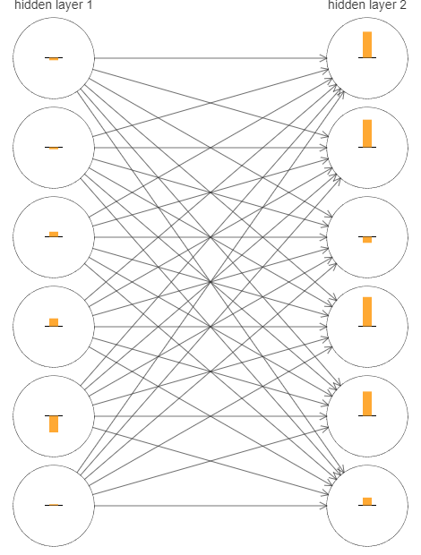

# 为什么深层神经网络难以训练？
设想现在你是一名工程师，你的上司要求你去设计一台计算机。当你在办公室里设计逻辑电路，摆弄各种门电路的时候，你的上司带着一个坏消息走了进来：顾客提出了一个新的设计需求，整个计算机中的电路最多只能有两层！



你表示很吃惊，对上司说：“这个顾客肯定疯了！”

你的上司回复：“我也认为他疯了~不过，顾客是上帝，他要什么就给他什么！”

其实，在某种程度上说，顾客并没有疯。设想你有一个特殊的逻辑电路，可以允许你对任意多的输入进行求和（$\text{AND}$）。而且你还有一个特殊的允许多输入的与非门（$\text{NAND}$），它可以对输出进行求和（$\text{AND}$），然后对输出取非（negate）。在拥有这样的特殊的逻辑电路之后，使用一个仅深为两层的电路，就可以计算任何的函数。

但在实际中，这可能并不是一个好的主意，在解决类似于电路设计问题或者其他任何相似的算法问题时，我们通常从如何解决它的子问题开始思考，然后逐渐把它们整合起来。换句话说，我们构建一个多层抽象来解决问题。

举例来说，设想我们要设计一个逻辑电路，它可以对两个数字进行相乘。我们可以先构建一个子电路，它可以对两个数进行相加。然后，再把它分解为更小的子问题，例如对两个比特进行相加。这样，我们可以非常粗糙的说，电路就像这样：


这也就是说，我们最终的电路最少包含三层组件。当然，随着子问题的不断增多，电路的层数也会随之增加。

看起来，深层的电路，可以让设计的过程变的简单。其实它的作用不仅如此，已经有数学上的证明，对于某些函数的计算，相比于深层电路，浅层的电路需要更多的成指数增长的组件。例如，上世纪八十年代发表的一系列著名的论文*证明了对于比特的奇偶校验计算，浅层的电路需要指数级增长的门组件。换句话说，如果你使用深层电路，只需要很少的电路组件就可以轻松地计算奇偶校验：你只需要先计算一部分比特的奇偶性，然后使用计算的结果再去计算更多的比特，如此反复，可以快速地得到最终的奇偶性。从而深层电路的表现从本质上真正超越了浅层电路。

> *这一段历史比较复杂，所以我不会给出具体的参考。如果你实在有兴趣的话，可以看看Johan Håstad在2012年发表的论文[On the correlation of parity and small-depth circuits](http://eccc.hpi-web.de/report/2012/137/)。

到现在为止，本书表现的就像那个疯狂的顾客一样，我们使用过的所有网络几乎都只有一个隐藏层：



网络虽然简单，但是表现得很不错，在之前的章节里，我们使用的网络在识别手写数字问题上达到了百分之九十八的准确率！尽管表现的已经够好了，但是我们期望一个深层网络会表现的更为强大：



我们可以用之前使用的多层的抽象来构建这样的网络。例如，如果我们打算做视觉模式识别，那么网络中第一层的神经元可能被用来学习识别物体的边，第二层中的神经元被用来识别更复杂的形状，比如三角形或者矩形，第三层用来识别更更复杂的形状，如此类推。这种多层抽象的概念似乎告诉我们，深层网络在解决复杂模式识别问题上会表现的很好。与电路的情况相同，有一些理论上的证明*，深层网络在本质上要比浅层网络更强大。

> *Razvan Pascanu、Guido Montúfar 和 Yoshua Bengio 在一些问题和一些网络结构上证明了这一点，详见 [On the number of response regions of deep feed forward networks with piece-wise linear activations](http://arxiv.org/pdf/1312.6098.pdf)（2014）。更多的讨论，参见 Yoshua Bengio 所写的 [Learning deep architectures for AI](http://www.iro.umontreal.ca/~bengioy/papers/ftml_book.pdf)（2009）的第二章

那么，我们该如何训练这样的深层网络呢？在本章中，我们会尝试使用之前介绍的强大的学习算法——随机梯度下降和反向传播，来训练深层网络。但是结果表明，深层的网络并没有比浅层的网络表现的多好。

为什么会得到这样的结果呢？我们一开始的讨论不是证明深层网络很强大吗？我们会一步一步了解到，为什么我们的深层网络难以训练。当我们看的更仔细的时候，我们会发现，网络中不同层的学习速率有着很大的不同。特别地，当后面的层学习的非常快的时候，前面的层的学习陷入了停滞，它们几乎学不到任何东西了。这种学习上的停滞并不是因为运气不好，随后我们会发现，其中有一些基础的原因导致了学习停滞，而且与我们使用的基于梯度的学习技巧有关。

在我们深入问题之前，我们先来看看另外一个可能发生的相反的现象：前面的层可能学的很好，而后面的层的学习则陷入了停滞。事实上，我们会发现，在深的、多层的网络中用梯度下降进项学习，会有一个内在的不稳定性因素。这种不稳定性因素即有可能导致前面的层的学习陷入停滞，也有可能导致后面的层的学习陷入停滞。

这虽然听起来是个不好的消息，但是在深入了解这种不确定性因素后，我们可以尝试解决这个问题，从而有效率地训练深层的网络。这种探索，将为我们在下一章的内容，图像识别问题，打下良好的基础。

## 梯度消失问题

那么，是什么问题阻碍了我们去训练深层网络呢？

为了回答这个问题，让我们首先考虑只有一个隐藏层的网络。我们依旧使用MNIST数字分类问题来学习和实验。

如果可以的话，你可以在你自己的电脑上训练网络。当然，只阅读本文也是可以的。训练网络需要`Python 2.7`，`Numpy`，以及相应的代码。你可以根据下面的地址来克隆一份代码：

```python
git clone https://github.com/mnielsen/neural-networks-and-deep-learning.git
```

如果你不使用`git`的话，你也可以点击[这里](https://github.com/mnielsen/neural-networks-and-deep-learning/archive/master.zip)下载数据和代码，这需要更改`src`子目录。

> 译者注：Michal Daniel Dobrzanski提供了一份Python 3的代码，地址如下：
>
> ```python
> git clone https://github.com/MichalDanielDobrzanski/DeepLearningPython35.git
> ```
>
> 或点击[这里](https://github.com/MichalDanielDobrzanski/DeepLearningPython35)下载。

然后，在Python命令行中加载MNIST数据：

```python
>>> import mnist_loader
>>> training_data, validation_data, test_data =\
... mnist_loader.load_data_wrapper()
```

设置网络：

```python
>>> import network2
net = network2.Network([784, 30, 10])
```

这个网络的输入层有 $784$ 个神经元，对应图片中 $28 \times 28 = 784$ 个像素。我们使用 $30$ 个隐藏神经元，以及 $10$ 个输出神经元，对应图片中 $10$ 种可能的数字分类，$(0, 1, 2, \dots , 9)$。

让我们试着对网络训练30次完整的epochs，使用大小为10的mini-batch训练样本，学习率设置为 $\eta = 0.1$，正则化系数设置为 $\lambda = 5.0$。在训练的时候，我们跟踪`validation_data`*上分类准确度的变化。

> *这可能花费一些时间去训练网络，取决于你机器的性能。所以在训练的时候，你可以继续阅读本书，无需等待程序运行结束。

```python
>>> net.SGD(training_data, 30, 10, 0.1, lmbda=5.0,
... evaluation_data=validation_data, monitor_evaluation_accuracy=True)
```

最后，我们获得的分类准确度为 $96.48\%​$（实际的结果可能会稍有出入，因为每次运行的结果不会完全相同），与我们之前训练的结果大致相同。

现在，让我们增加一个拥有 $30$ 个神经元的隐藏层，在相同的参数下再训练一次：

```python
>>> net = network2.Network([784, 30, 30, 10])
>>> net.SGD(training_data, 30, 10, 0.1, lmbda=5.0,
... evaluation_data=validation_data, monitor_evaluation_accuracy=True)
```

我们的结果有了一些提升，大约为 $96.90\%$。

这是个令人振奋的结果：多了一层，我们的结果就好了一些！让我们试着再增加一层：

```python
>>> net = network2.Network([784, 30, 30, 30, 10])
>>> net.SGD(training_data, 30, 10, 0.1, lmbda=5.0,
... evaluation_data=validation_data, monitor_evaluation_accuracy=True)
```

我们并没有得到更好的结果！事实上，结果比以前更差，只有 $96.57\%$，和我们原始的浅层网络的表现差不多。让我们试着再加一层：

```python
>>> net = network2.Network([784, 30, 30, 30, 30, 10])
>>> net.SGD(training_data, 30, 10, 0.1, lmbda=5.0,
... evaluation_data=validation_data, monitor_evaluation_accuracy=True)
```

分类准确度又降低了，现在是 $96.53\%$。虽然在数值上并不是一个很显著的降低，但这个结果很糟糕。

网络的表现看起来很奇怪。增加更多的隐藏层，网络应该可以学习到更多更复杂的分类函数，分类效果应该更好才对。就算增加的隐藏层不能提升效果，但为什么效果还会降低？这不科学！

所以到底发生了什么？假如增加的隐藏层真的可以帮助模型去学习，是不是我们的学习算法不能找到正确的权值和biases呢？我们想要搞清楚学习算法到底出了什么问题，以及如何做才能解决这个问题。

为了更好的理解哪里出了错，让我们把网络学习的过程可视化。下面，我画了一个网络的局部图，这个网络的结构是 $[784, 30, 30, 10]$，也就是说，这个网络拥有两个隐藏层，每层拥有 $30$ 个隐藏神经元。图中每个神经元上都有一个很小的矩形标识，它表示神经元在学习的过程中变化的速度。大的矩形意味着神经元的权值和bias变化的非常快，而小的矩形意味着权值和bias变化的非常慢。更准确地说，矩形表示每个神经元的梯度 $\partial C / \partial b$， 即代价的变化对神经元bias的比率。在第二章中，我们知道梯度的大小不仅控制着bias的变化速率，还控制着神经元加权输入的变化速率。如果你没有回忆起这些细节的话，不要担心：你只需要简单地记住，这些矩形代表着在网络学习的过程中，神经元权值和bias的变化速率。

为了让下图更简洁，我只展示了两个隐藏层中最上面的十二个神经元。我忽略了输入神经元，因为它们没有可供学习的权值或biases。我也忽略了输出神经元，因为我们做的是层之间的比较，如果对比的层之间拥有相同的神经元数量，结果会更有意义。图中展示的是网络刚开始训练时的情形*：

> *图片由程序`generate_gradient.py`生成。本节后面的图片也是由该程序生成。



因为该网络是随机初始化的，所以有很多神经元在快速地进行变化。以及，我们发现，第二个隐藏层中神经元的矩形要比第一个隐藏层中神经元的矩形更大。也就是说，第二层中的神经元要比第一层中的神经元变化地更快。这只是一种巧合，还是普遍地，第二层中的神经元要比第一层中的神经元学习的更快？

为了搞清楚其中的原因，我们需要有一种比较不同层学习速率的方法。为了做到这一点，让我们把梯度表示为 $\delta_j^l = \partial C / \partial b_j^l$，即第 $i$ 层中第 $j$ 个神经元的梯度*。我们可以把梯度 $\delta^1$ 看做是一种向量，它代表着第一个隐藏层中神经元学习的速率，$\delta^2$ 看做是第二个隐藏层中神经元学习的速率。然后把这些向量的长度（粗糙地！）看做是每一个隐藏层总的学习速率。例如，长度 $||\delta^1||$ 衡量了第一个隐藏层学习的速率，$||\delta^2||$ 衡量了第二个隐藏层学习的速率。

> *在第二章中我们把这个叫做误差（error），但是在这里我们使用梯度（gradient）这个不正式地叫法。说其”不正式“是因为它显然不是代价对于权值的偏导，$\partial C / \partial w$。

根据这些定义，在上图中我们发现 $||\delta^1|| = 0.07 \dots, ||\delta^2|| = 0.31 \dots$。这证明了我们之前的猜想：第二个隐藏层中的神经元确实要比第一个隐藏层中的神经元学习的快。

如果我们添加更多的隐藏层呢？假设我们的网络有三个隐藏层，$[784, 30, 30, 30, 10]$，则最终得到的学习速度分别是 $0.012, 0.060, 0.283$。我们再次发现，前面的层要比后面的层学的更慢。如果再加一层的话，相应的学习速度分别是 $0.003, 0.017, 0.070, 0.285$。我们确信：前面的层学的更慢。

我们一直关注的是刚开始训练的时候网络的学习速度，也就是说，在网络刚刚初始化之后。那么，在随后训练的过程中，学习速度会有什么变化呢？让我们回到只有两个隐藏层的情况，学习速度的变化如下图所示：


为了得到上述结果，我在 $1,000$ 个训练图片上使用梯度下降，训练了 $500$ 个epochs。这与我们之前通常的训练方法有所不同：我没有使用mini-batch，只利用了 $1,000$ 个训练图片，而不是完整的 $50,000$ 个图片训练集。当然，我并不是想去做一些奇怪的事情，而是因为使用基于mini-batch的随机梯度下降会导致非常多的噪声